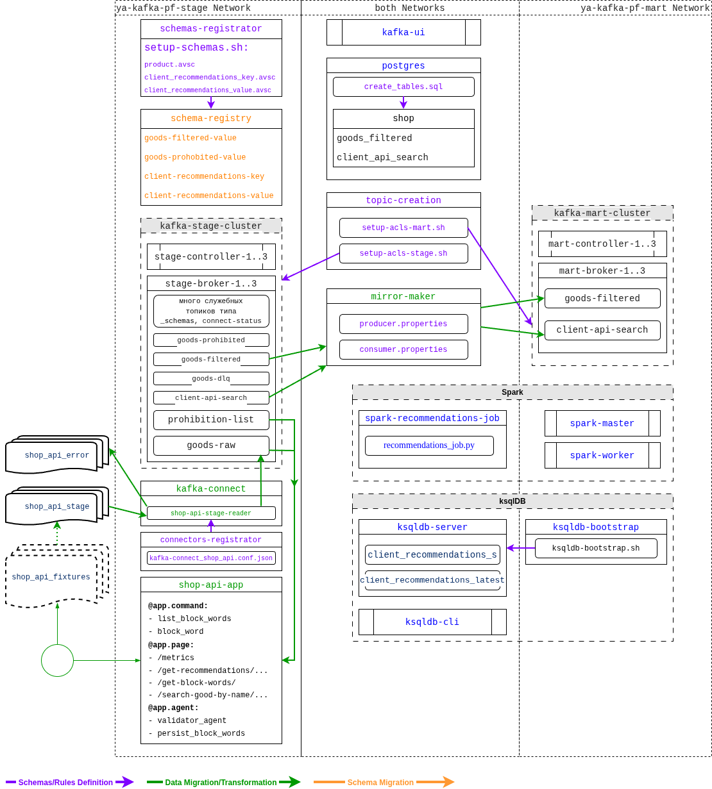

# Финальный проект курса "Apache Kafka для разработки и архитектуры"

## Содержание

- [Общее описание](#general_descr)
  - [Описание](#general_descr_descr)
  - [Используемые технологии](#general_descr_technologies)
  - [Схема сервисов, дата-пайплайн, взаимодействие](#general_descr_schemas)
    - [Структура проекта по сервисам, дата-пайплайны](#general_descr_schemas_1)
    - [Зависимости сервисов](#general_descr_schemas_2)
  - [Техдолг и т.п.](#general_descr_todo)
  - [Как проверять проект](#general_assignment_review)
- [Быстрая проверка](#fast_assignment_review)
- [Разработка: Итерация 1: Два Kafka-кластера в репликации ведущий-ведомый. Mirror Maker.](#dev_proc_iteration_1)
  - [Узлы (сервисы в компоузере)](#dev_proc_iteration_1_nodes)
  - [Ограничения первой фазы](#dev_proc_iteration_1_limitations)
  - [Файлы 1-й итерации (для наглядности версионирования по фазам процесса разработки)](#dev_proc_iteration_1_files)
  - [Что проверяем после итерации](#dev_proc_iteration_1_checks)
  - [Запускаемся после первой фазы и проверяемся](#dev_proc_iteration_1_run)
    - [1.1. Ничего не будем менять в .env.example и соотв. нигде](#dev_proc_iteration_1_run_1)
    - [1.2. Генерируем сертификаты](#dev_proc_iteration_1_run_2)
    - [1.3. Разворачиваемся, убеждаемся в общей работоспособности проекта](#dev_proc_iteration_1_run_3)
  - [План на Итерацию 2](#dev_proc_iteration_1_next_iteration_planning)
- [Разработка: Итерация 2: SHOP API. Kafka Connect, Schema Registry, Faust.](#dev_proc_iteration_2)
  - [Узлы (сервисы в компоузере)](#dev_proc_iteration_2_nodes)
  - [Файлы 2-й итерации (для наглядности версионирования по фазам процесса разработки)](#dev_proc_iteration_2_files)
  - [Что проверяем после итерации](#dev_proc_iteration_2_checks)
  - [2.1. Kafka connect, source-коннектор shop-api-stage-reader (SpoolDirSchemaLessJsonSourceConnector)](#dev_proc_iteration_2_1)
    - [Сначала проверяем работу системы с пользователем admin в kafka-connect:](#сначала-проверяем-работу-системы-с-пользователем-admin-в-kafka-connect)
    - [Провернём всё то же, но под пользователем `connect_user`.](#провернём-всё-то-же-но-под-пользователем-connect_user)
  - [2.2. Schema Registry](#dev_proc_iteration_2_2)
  - [2.3. Faust-приложение](#dev_proc_iteration_2_3)
    - [Что куда добавляем](#dev_proc_iteration_2_3_1)
    - [Добавление конфига в коннектор выносим в сервис](#dev_proc_iteration_2_3_2)
    - [Проверяем](#dev_proc_iteration_2_3_3)
  - [План на Итерацию 3](#dev_proc_iteration_2_next_iteration_planning)
- [Разработка: Итерация 3: CLIENT API. PostgreSQL.](#dev_proc_iteration_3)
  - [Узлы (сервисы в компоузере)](#dev_proc_iteration_3_nodes)
  - [Файлы 3-й итерации (для наглядности версионирования по фазам процесса разработки)](#dev_proc_iteration_3_files)
  - [Что проверяем после итерации](#dev_proc_iteration_3_checks)
  - [3.1. Внедряем PostgreSQL в проект](#dev_proc_iteration_3_1)
  - [3.2. Срез свежайшего состояния товаров из kafka-топика goods-filtered в postgres-таблицу goods_filtered](#dev_proc_iteration_3_2)
    - [Общее описание решения](#dev_proc_iteration_3_2_1)
    - [Проверяем](#dev_proc_iteration_3_2_2)
  - [3.3. CLIENT API: поиск по названию товара (с логами и статистикой)](#dev_proc_iteration_3_3)
    - [Общее описание решения](#dev_proc_iteration_3_3_1)
    - [Проверяем](#dev_proc_iteration_3_3_2)
  - [План на Итерацию 4](#dev_proc_iteration_3_next_iteration_planning)
- [Разработка: Итерация 4: Apache Spark. KSQLDB. Рекомендации.](#dev_proc_iteration_4)
  - [Узлы (сервисы в компоузере)](#dev_proc_iteration_4_nodes)
  - [Файлы 4-й итерации (для наглядности версионирования по фазам процесса разработки)](#dev_proc_iteration_4_files)
  - [Что проверяем после итерации](#dev_proc_iteration_4_checks)
  - [4.1. Внедряем Apache Spark в проект + простейший job про рекомендации](#dev_proc_iteration_4_1)
  - [4.2. Внедряем в проект KSQLDB + операция получения рекомендаций в Faust-приложении](#dev_proc_iteration_4_2)
    - [4.2.1. Общее описание](#dev_proc_iteration_4_2_1)
    - [4.2.2. Поработаем с ksql db через веб-интерфейс kafka-ui](#dev_proc_iteration_4_2_2)
    - [4.2.3. Или через cli-консоль](#dev_proc_iteration_4_2_3)
    - [4.2.4. Внедряем автосоздание этой таблицы в процесс развёртывания compose-проекта](#dev_proc_iteration_4_2_4)
    - [4.2.5. Http-операция получения рекомендаций (Faust-приложение)](#dev_proc_iteration_4_2_5)
  - [План на Итерацию 5](#dev_proc_iteration_4_next_iteration_planning)
- [Разработка: Итерация 5: Мониторинг: Prometheus, Grafana](#dev_proc_iteration_5)
  - [5.1. Эту итерацию делал Cursor. А мы проверим.](#dev_proc_iteration_5_cursor)
  - [5.2. Структура мониторинга](#dev_proc_iteration_5_structure)
  - [5.3. Алертинг (учебный минимум)](#dev_proc_iteration_5_alerting)
  - [5.4. Тестирование и воспроизведение работоспособности](#dev_proc_iteration_5_howto)

## <a name="general_descr">Общее описание</a>

### <a name="general_descr_descr">Описание</a>

Проект реализует учебно-демонстрационный функционал построения дата-пайплайнов условного маркетплейса: информация по товарам от продавцов, поисковые запросы от покупателей, аналитическая подсистема рекомендаций для покпателей - всё в потоковом режиме обработки (в реалтайме).

Ядром системы являются продукты семейства и экосистемы Apache Kafka и сопутствующий отраслевой Data Engeneering инструментарий (см. следующий раздел [Используемые технологии](#general_descr_technologies)).

Языком связки инструментария выбран python, системой развёртывания docker compose, python, shell.

Учебно-демонстрационный проект по возможности эмулирует продакшн-усилия, в частности Kafka развёртывается как два KRaft-кластера в репликации, по три контроллера и три брокера в каждом, защищённые по SSL(mTLS)/SASL/ACL, система оснащена инструментарием мониторинга (в меру возможностей ресурсов учебного standalone-проекта) и т.п.

### <a name="general_descr_technologies">Используемые технологии</a>

Технологии, библиотеки, вендоры, языки, форматы, etc.

- Apache Kafka, Kafka Connect, Schema Registry, Mirror Maker, ksqlDB,
- KRaft, SSL(mTLS)/SASL/ACL, SpoolDirSchemaLessJsonSourceConnector,
- Apache Spark, Spark Structured Streaming, PySpark,
- PostgreSQL, Prometheus, Grafana,
- Confluent, Bitnami,
- Docker, Docker compose,
- Python, Shell,
- Faust-streaming, psycopg, asyncio, aiokafka, prometheus_client,
- Avro, Streaming JSON

### <a name="general_descr_schemas">Схема сервисов, дата-пайплайн, взаимодействие</a>

#### <a name="general_descr_schemas_1">Структура проекта по сервисам, дата-пайплайны</a>



TODO

#### <a name="general_descr_schemas_2">Зависимости сервисов</a>

TODO

- Сначала надо развернуть два кафка-кластера
- Затем надо запустить сервис, который создаст необходимые топики, в частности служебные для разных сервисов, и выставит ACL-ы (завершается после выполнения задания) (завершается после выполнения задания) (завершается после выполнения задания). Это позволит нам сузить права некоторым сервисам, не давая им слишком много прав для создания ими служебных тоиков и т.п.
- Далее следует поднять Schema Registry,
- А вслед за ним - сервис, который зарегистрирует в Schema Registry необходимые для работы прочих сервисов схемы под необходимые топики (завершается после выполнения задания).
- После этого можно запускать Mirror Maker 1, за ним Kafka Connect, сервисы приложений и т.п.

### <a name="general_descr_todo">Техдолг и т.п.</a>

- Транзакционность и идемпотентность продьюсера Schema Registry (не снимая концепцию ограничения кастомного пользователя конкретными ACL-ами)
- Кластеризация Schema Registry (полезно)
- Faust-streaming заменить на FastStream `https://faststream.ag2.ai/latest/` (`aiokafka` не поддерживает Кафку 4, и вроде даже не собирается, соотв. и Faust-streaming, а вот FastStream посволяет использовать под капотом confluent, и вообще "он лучше")
- `exactly_once` в Faust-приложения (`processing_guarantee='exactly_once'`, но реализовать надо, не снимая концепцию ограничения кастомного пользователя конкретными ACL-ами под каждый сервис проекта)
- `kafka-connect` на SSL (mTLS)
- из `etc-kafka-secrets` не-секреты (avro-схемы, sh для бутстрапа и т.п.) разнести по вольюмам сервисов-бутстраперов например и т.п.
- пробежаться по сервисам проверить, кого не ограничили по памяти - того ограничить (соотнести с ограничениями внутри контейнеров, во избежание OOMKill-ов, замедления и т.п.)
- неспешно допродумать и отрефакторить/развить мониторинг
- ...

### <a name="general_assignment_review">Как проверять проект</a>

- Чтобы просто проверить исполнение - смотрим код в файлах и исполняемся по инструкциям в разделе **"Быстрая проверка"**,
- Чтобы проверить ход выполнения проекта - читаем следующие за ним разделы.


## <a name="fast_assignment_review">Быстрая проверка</a>

NB: везде, где далее по тексту встречается "192.168.100.225", у вас при развёртывании будет localhost или адрес вашей хостовой машины. Если необходимо - надо внести его в SAN-ы шаблона сертификата и перегенерировать сертификаты скриптом make-certs.sh (ниже по тексту, если дочитаете, мы это делаем на какой-то из первых итераций).

NB: как было указано выше, развёртывание проекта будет занимать какое-то не-мгновенное время, поскольку в процессе встроены сервисы, ожидающие запуска, отработки и настраивающие другие сервисы.

NB: конрейнерам ограничены ресурсы в compose.yaml (значения заданы переменными в env-файле) под работоспособность на хостовой машине с ограниченными ресурсами (32G RAM). Принеобходимости можно увеличить значения в env-файле (тут аккуратно: у некоторых сервисов внутри контейнеров есть настройки в файлах конфигураций, которые надо соотносить со внешними ограничениями контейнеров).

NB: рекомендую разворачивать проект с аргументом --env-file .env.example или переименовать/скопировать .emv.example в .env. Не рекомендую менять значения переменных в env-файле, так как не всё покрыто переменными, и для многих настроек сервисов меняя переменные в env-файле надо согласованно поменять строки в файлах конфигураций, и даже в compose.yaml (ключи словарей).

Для быстрой проверки мы развернём compose-проект, зададим руками (через cli api) стоп-слова для фильтрации запрещённых товаров по названиям, зальём фикстуры в директорию, которую прочитает Kafka Connect, и далее отработает пайплайн, а мы сделаем пару поисков товаров от разных пользователей по http api, и так же по http api посмотрим на условные рекомендации от аналитической подсистемы.

Далее можно заливать товары, управлять списком стоп-слов, искать, смотреть, как меняются рекомендации, смотреть в веб-интерфейсах состояния подсистем, топики, рсубд, мониторинг, чтобы убедиться, что всё работает как задумано и описано.

```
sudo docker compose --env-file .env.example up -d --build

192.168.100.225 === localhost
```

## <a name="dev_proc_iteration_1">Разработка: Итерация 1: Два Kafka-кластера в репликации ведущий-ведомый. Mirror Maker.</a>

### <a name="dev_proc_iteration_1_nodes">Узлы (сервисы в компоузере)</a>

- два кафка-кластера, каждый в своей докер-сети, `KRaft`, в каждом кластере три контроллера и три брокера, SSL(TLS)/SASL/ACL
- `kafka-ui`, в двух сетях, настройка на два кластера, ACL даёт "много прав" (для упрощения)
- служебный узел для автосоздания топика, в двух сетях, отрабатывает и умирает
- узел для запуска `Mirror Maker 1`, в двух сетях, репликация одного топика из ведущего кластера в ведомый

### <a name="dev_proc_iteration_1_limitations">Ограничения первой фазы</a>

- **Сертификаты** - подготавливаем руками до разворачивания проекта (есть bash-скрипт, см. его код перед зхапуском), прокидываем volume-ами
- **Настройка ACL** - bash-скриптами, запускаемыми руками на брокере каждого из двух кластеров. Предварительно же обозначаем трёх суперпользователей в каждом кластере.
- Без узлов серверов приложений, без кафка коннекта, без схема реджистри
- Ограничения ресурсов контейнеров через deploy-секции compose: минимальный ресурс, для запуска на одной машине
- Конфигурирование через `env`-файл: насколько возможно, при изменении конфига требуются так же небольшие изменения в `bash`-скриптах, `entrypoint`-ах сервисов компоузера, пересоздание сертификатов и т.п., в зависимости от изменений

### <a name="dev_proc_iteration_1_files">Файлы первой итерации (для наглядности версионирования по фазам процесса разработки)</a>

```bash
tree -a phase1

phase1
├── ca.cnf
├── compose.yaml
├── .env.example
├── etc-kafka-secrets
│   ├── setup-acls-mart.sh
│   └── setup-acls-stage.sh
├── kafka.cnf.template
└── make-certs.sh
```

### <a name="dev_proc_iteration_1_checks">Что проверяем после итерации</a>

Что у нас есть два кластера, которые запускаются и не падают, и что сообщения из определённого топика реплицируются из одного в другой.

Так же убеждаемся, что работают ACL (в части пользователя Кафка юи), делая ошибки в сертификатах (в SAN) так же убеждаемся, что работает SSL(TLS)+SASL.

### <a name="dev_proc_iteration_1_run">Запускаемся после первой фазы и проверяемся</a>

NB: с каждой итерацией всё больше будет автоматизации при разворачивании проекта.

Копируем содержимое директории `phase1` в директорию проета на хостовой машине, идём по шагам:

#### <a name="dev_proc_iteration_1_run_1">1.1. Ничего не будем менять в .env.example и соотв. нигде</a>

Но если надо, то например `SAN`-ы меняем/добавляем в `[alt_names]` в `kafka.cnf.template` и `.env.example`, ограничения ресурсов в `.env.example`, если меняли названия хостов контейнеров, то кроме `compose.yaml` надо поменять `setup-acls-mart.sh` и `setup-acls-stage.sh`, и т.д.

#### <a name="dev_proc_iteration_1_run_2">1.2. Генерируем сертификаты</a>

Скрипт `make-certs.sh`

- создаст `tmp`-директорию,
- в ней сгенерит `kafka.cnf` из `kafka.cnf.template` и `.env.example`,
- на основе `ca.cnf` и `kafka.cnf` за несколько шагов создаст `kafka.keystore.pkcs12` и `kafka.truststore.jks`,
- поместит их в `etc-kafka-secrets`,
- `tmp`-директорию с промежуточными файлами удалит.

```bash
chmod +x make-certs.sh
make-certs.sh
```

#### <a name="dev_proc_iteration_1_run_3">1.3. Разворачиваемся, убеждаемся в общей работоспособности проекта</a>

**Разворачиваем проект:**

```bash
# это просто посмотреть, что 100500 переменных окружения отработали
sudo docker compose --env-file .env.example config
...
sudo docker compose --env-file .env.example up -d
...
sudo docker ps -a
...
# можно посмотреть topic-creation, mirror-maker, оба первых брокера, допустим
sudo docker logs ...
# мы заморочились с лимитированием ресурсов - посмотрим на них :)
sudo docker stats --no-stream
```

**И идём в веб UI:**

`http://localhost:8070/` на хостовой машине (удалённо у меня она же `http://192.168.100.225:8070/`) - видим два наших кластера и по нолю топиков в каждом кластере, но у нас (у пользователя `kafka_ui`) пока и нет прав (поэтому мы топики и не видим).

**Дадим права пользователю `kafka_ui`:**

Два разных немножко bash-скрипта запустим один на брокере `stage`-кластера, второй - `mart`-кластера.

**stage-broker-1:**

```bash
tesla@tesla:/.../ya_kafka_project_final$ sudo docker exec -it stage-broker-1 bash

[root@stage-broker-1 appuser]# chmod +x /etc/kafka/secrets/setup-acls-stage.sh

[root@stage-broker-1 appuser]# /etc/kafka/secrets/setup-acls-stage.sh

--- 1. Очистка старых ACL ---
--- 2. Создание топиков ---
--- 3. Ожидание готовности топиков ---
--- 4. Настройка прав для kafka_ui ---
...
--- Настройка завершена! ---
Current ACLs for resource `ResourcePattern(resourceType=GROUP, name=*, patternType=LITERAL)`:

    (principal=User:kafka_ui, host=*, operation=READ, permissionType=ALLOW)
    (principal=User:kafka_ui, host=*, operation=DESCRIBE, permissionType=ALLOW) 
...

[root@stage-broker-1 appuser]# exit
exit
```

**mart-broker-1:**

```bash
tesla@tesla:/.../ya_kafka_project_final$ sudo docker exec -it mart-broker-1 bash

[root@mart-broker-1 appuser]# chmod +x /etc/kafka/secrets/setup-acls-mart.sh

[root@mart-broker-1 appuser]# /etc/kafka/secrets/setup-acls-mart.sh

--- 1. Очистка старых ACL ---
--- 2. Создание топиков ---
--- 3. Ожидание готовности топиков ---
--- 4. Настройка прав для kafka_ui ---
...
--- Настройка завершена! ---
Current ACLs for resource `ResourcePattern(resourceType=GROUP, name=*, patternType=LITERAL)`:

    (principal=User:kafka_ui, host=*, operation=READ, permissionType=ALLOW)
    (principal=User:kafka_ui, host=*, operation=DESCRIBE, permissionType=ALLOW) 
...

[root@mart-broker-1 appuser]# exit
exit
tesla@tesla:/media/tesla/NETAC_4T/VCS/ya_kafka_project_final$
```

**И идём в веб UI:**

`http://localhost:8070/` (`http://192.168.100.225:8070/`) - теперь видим кол-во топиков в каждом кластере.

Это подтверждает работоспособность наших настроек SSL/SASL/ACL.

Видим, что топик `goods-filtered` создан на обоих кластерах.

**Напишем что-то в этот топик, и он реплицируется между кластерами**

Пойдём напишем что-то в него в кластере `stage` и если всё хорошо с нашим `Mirror Maker 1` - увидим сообщение в кластере `mart`.

**ДА, ВСЁ РАБОТАЕТ, УРА.**

### <a name="dev_proc_iteration_1_next_iteration_planning">План на Итерацию 2</a>

**Теперь надо реализовать `SHOP API`**, для этого

- присовокупить к сервисам `Kafka Connect`
- и `Schema Registry`,
- сервис с приложением на `Faust-streaming`,
- source-коннектор файловый,
- залить в `Schema Registry` avro-схему,
- создать топики, необходимые для работы фауст-приложения,
- научить то приложение фильтровать топик,
- а так же приделать ендпойнты на управление стоп-словами в названиях товаров (и реализовать),
- нагенерить несколько файлов-источников товаров,
- придумать, как они будут попадать в source-директорию для коннектора,
- и т.п.

Как-то так (предварительно).

---

`goods-raw`, `goods-filtered`, `goods-dlq`, `goods-prohibited`

- `goods-raw`: сюда пишет Kafka Connect
- `goods-dlq`: `dead letter queue` - сюда Faust-воркер отправляет соолбщения, не прошедшие по схеме
- `goods-prohibited`

Во втором кластере только топик `goods-filtered`, который получает данные из топика первого кластера через MirrorMaker 1.

Топик `goods-raw` получает данные через т. наз. `SHOP API`: разворачиваем `Kafka Connect`, в нём коннектор чтения файлов из директории `shop_api_stage`.

Как файлы попадают в эту директорию: руками.... Ну или `bash`- или `python`- скрипт `shop_api_emulator` имитирует поступление файлов в эту эмуляцию API, копируя их из директории `shop_api_fixtures` с какой-то периодичностью, "пара штук" файлов. Файлы предсозданы, лежат у нас в проекте в git, директория подключается `volume`-ом.

Faust-приложение фильтрует сообщения из `goods-raw`, хорошие отправляет в `goods-filtered`, остальные - в `goods-dlq` (развернуть Schema Registry и залить в него схему товаров) и `goods-prohibited` (прочитались, но не прошли `prohibited`-фильтр).

Фауст будет запускать приложение "резидентом" и поддерживать работоспособность (+ superviserd), мы так делали в уроке про стоп-слова или что-то такое. И добавить интерфейс чтения списка и добавления/удаления запрещённых товаров, как в той же домашке...

Faust-приложение для CLIENT API - это про другое, про следующую итерацию.

Нужен ли уже сейчас ksqldb? не обязательно. Как стыковать ksqldb с TLS/SASL/ACL? Продумать...

Мониторинг: на следующих итерациях.

Тестирование и отладка: Продумать...

Чего нам надо добиться на этом этапе: `goods-filtered` на втором кластере, заполнен из файлов, по авро-схеме...


## <a name="dev_proc_iteration_2">Разработка: Итерация 2: SHOP API. Kafka Connect, Schema Registry, Faust.</a>

### <a name="dev_proc_iteration_2_nodes">Узлы (сервисы в компоузере)</a>

```
--services

stage-controller-1, stage-controller-2, stage-controller-3
stage-broker-1, stage-broker-2, stage-broker-3

mart-controller-1, mart-controller-2, mart-controller-3
mart-broker-1, mart-broker-2, mart-broker-3

mirror-maker
schema-registry
kafka-connect
kafka-ui

topic-creation, schemas-registrator, connectors-registrator

shop-api-app

-- networks

ya-kafka-pf-stage
ya-kafka-pf-mart

```

### <a name="dev_proc_iteration_2_files">Файлы второй итерации (для наглядности версионирования по фазам процесса разработки)</a>

```bash
tree -a phase2

phase2
├── ca.cnf
├── compose.yaml
├── .env.example
├── etc-kafka-secrets
│   ├── kafka-connect_shop_api.conf.json
│   ├── kafka.keystore.pkcs12
│   ├── kafka.truststore.jks
│   ├── product.avsc
│   ├── setup-acls-mart.sh
│   ├── setup-acls-stage.sh
│   └── setup-schemas.sh
├── kafka.cnf.template
├── kafka-connect
│   ├── Dockerfile
│   └── plugins
│       └── kafka-connect-spooldir
│           ├── ...
│           ├── kafka-connect-spooldir-2.0.71.jar
│           ├── ...
├── make-certs.sh
├── shop-api-app
│   ├── app
│   │   ├── requirements.txt
│   │   └── shop_api
│   │       ├── agents.py
│   │       ├── app.py
│   │       ├── commands.py
│   │       ├── __init__.py
│   │       ├── __main__.py
│   │       ├── models.py
│   │       ├── pages.py
│   │       ├── tables.py
│   │       └── topics.py
│   ├── Dockerfile
│   └── supervisord.conf
└── shop_api_fixtures
    ├── boo.json
    ├── moo.json
    ├── store_001_1.json
    └── store_001_2.json
```

### <a name="dev_proc_iteration_2_checks">Что проверяем после итерации</a>

После заполнения списка стоп-слов (запрещённые подстроки в названиях товаров) в cli api и перемещения файлов из директории `shop_api_fixtures` в директорию `kafka-connect/data/shop_api_stage`, автоматический data-pipeline заполняет топики `goods-raw`, `goods-dlq`, `goods-prohibited`, `goods-filtered` в Kafka-кластере `kafka-stage-cluster` и топик `goods-filtered` в Kafka-кластере `kafka-mart-cluster`.

### <a name="dev_proc_iteration_2_1">2.1. Kafka connect, source-коннектор shop-api-stage-reader (SpoolDirSchemaLessJsonSourceConnector)</a>

Файлы из директории `shop_api_stage` Kafka-коннектором `SpoolDirSchemaLessJsonSourceConnector` будут писаться в топик `goods-raw` без схемы.

Файлы после успешной переброски будут удаляться. При ошибках - перемещаться в директорию `shop_api_error`.

Работа со схемой будет реализована на следующем этапе - python-приложением, которое будет фильтровать сообщения из топика `goods-raw` в топики `goods-filtered`, `goods-dlq`, `goods-prohibited`.

Настройка коннекта под jmx-метрики - так же на следующих итерациях.

Для этого нам надо добавить узел `kafka-connect` в проект, добавить его в `SAN`-ы сертификата, в сервис создания топиков добавить создание топика `goods-raw` на `stage`-кластере, настроить коннектор работать от пользователя `connect_user`, которого внести в права на необходимые (в том числе служебные) топики, группы и т.п. (`./etc-kafka-secrets/setup-acls-stage.sh`) и т.д.

Плагин берём отсюда: https://hub-downloads.confluent.io/api/plugins/confluentinc/kafka-connect-spooldir/versions/2.0.71/confluentinc-kafka-connect-spooldir-2.0.71.zip, и помещаем в контейнер при сборке (чтобы не вызывать `confluent-hub install` каждый раз).

Источниками данных будем рассматривать любые `.json`-файлы в директории, предполагая, что в каждом файле могут размещаться один и более json-объектов один за другим без обрамления в общий массив. Объекты pretty-форматированные, и друг от друга отделённые простыми переносами строк (Concatenated/Streaming JSON).

После запуска проекта надо установить коннектор через конфиг в файле `./etc-kafka-secrets/kafka-connect_shop_api.conf.json`.

Так же надо раздать права пользователшю кафка-коннет, и выставить права на лиректории с файлами, приаттаченные фольюмом.

После этого кидаем файлы в директорию, они должны исчезать, а товары из них появляться в топике.

#### Сначала проверяем работу системы с пользователем admin в kafka-connect:

1. запускаемся

```bash
sudo docker compose --env-file .env.example up -d
...
sudo docker ps -a
...
sudo docker logs topic-creation
...
Created topic goods-filtered.
Created topic goods-filtered.
...
sudo docker stats --no-stream
...
```

Всё хорошо.

2. директории для работы коннекта - ставим владельца и права

на хостовой машине (директории расшарены как volume)

```bash
tesla@tesla:.../ya_kafka_project_final$ ls -lah kafka-connect/data
...
drwxr-xr-x 2 root  root  4.0K Mar 22 10:14 shop_api_error
drwxr-xr-x 2 root  root  4.0K Mar 22 10:14 shop_api_stage

tesla@tesla:.../ya_kafka_project_final$ sudo chown -R 1000:1000 kafka-connect/data
tesla@tesla:.../ya_kafka_project_final$ sudo chmod -R 775 kafka-connect/data
tesla@tesla:.../ya_kafka_project_final$ ls -lah kafka-connect/data
...
drwxrwxr-x 2 tesla tesla 4.0K Mar 22 10:14 shop_api_error
drwxrwxr-x 2 tesla tesla 4.0K Mar 22 10:14 shop_api_stage

```

3. проверим rest api кафка-коннект-а

```bash
# порт для рест апи мы обозначили как 8083, а наружу светим его как 8073
tesla@tesla:.../ya_kafka_project_final$ curl -s http://localhost:8073/connectors | jq
[]
```

Пустой массив в ответ - всё работает.

4. Отправим наш конфиг (`./etc-kafka-secrets/kafka-connect_shop_api.conf.json`) для создания коннектора `shop-api-stage-reader`

```bash
# 8073, connectors, "name": "shop-api-stage-reader"
curl -sX POST -H 'Content-Type: application/json' --data @./etc-kafka-secrets/kafka-connect_shop_api.conf.json http://localhost:8073/connectors | jq

tesla@tesla:.../ya_kafka_project_final$ curl -sX POST -H 'Content-Type: application/json' --data @./etc-kafka-secrets/kafka-connect_shop_api.conf.json http://localhost:8073/connectors | jq
{
  "name": "shop-api-stage-reader",
  "config": {
    "connector.class": "com.github.jcustenborder.kafka.connect.spooldir.SpoolDirSchemaLessJsonSourceConnector",
    "tasks.max": "1",
    "input.path": "/data/shop_api_stage",
    "error.path": "/data/shop_api_error",
    "input.file.pattern": "^.*\\.json$",
    "cleanup.policy": "DELETE",
    "halt.on.error": "false",
    "topic": "goods-raw",
    "key.converter": "org.apache.kafka.connect.storage.StringConverter",
    "value.converter": "org.apache.kafka.connect.json.JsonConverter",
    "value.converter.schemas.enable": "false",
    "name": "shop-api-stage-reader"
  },
  "tasks": [],
  "type": "source"
}

tesla@tesla:.../ya_kafka_project_final$ curl -s http://localhost:8073/connectors | jq
[
  "shop-api-stage-reader"
]

curl -s http://localhost:8073/connectors/shop-api-stage-reader | jq
...

curl -s http://localhost:8073/connectors/shop-api-stage-reader/config | jq
...

tesla@tesla:.../ya_kafka_project_final$ curl -s http://localhost:8073/connectors/shop-api-stage-reader/status | jq
{
  "name": "shop-api-stage-reader",
  "connector": {
    "state": "RUNNING",
    "worker_id": "kafka-connect:8083"
  },
  "tasks": [
    {
      "id": 0,
      "state": "RUNNING",
      "worker_id": "kafka-connect:8083"
    }
  ],
  "type": "source"
}

```

Вроде всё норм.

5. Теперь посмотрим логи коннектора и брокера

Добиваемся, чтобы не было ошибок. Например ниже ошибка, причина которой в том, что для сервиса `kafka-connect` проекта мы забыли прописать `CONNECT_PRODUCER_SSL_`-переменные окружения рядом с `CONNECT_SSL_`-переменными.

```bash
...$ sudo docker logs -n 20 kafka-connect
...
[2026-03-22 10:12:15,802] ERROR [Producer clientId=connector-producer-shop-api-stage-reader-0] Connection to node -1 (stage-broker-1/172.18.0.2:1092) failed authentication due to: SSL handshake failed (org.apache.kafka.clients.NetworkClient)
...

...$ sudo docker logs -n 20 stage-broker-1
...
[2026-03-22 10:14:01,679] INFO [SocketServer listenerType=BROKER, nodeId=1000] Failed authentication with /172.18.0.11 (channelId=172.18.0.2:1092-172.18.0.11:43870-165) (SSL handshake failed) (org.apache.kafka.common.network.Selector)
...
```

После всех правок - всё работает (пока мы ещё не кидали никакие файлы в директорию):

```bash
...
[2026-03-22 11:29:13,534] INFO No files matching input.file.pattern were found in /data/shop_api_stage (com.github.jcustenborder.kafka.connect.spooldir.InputFileDequeue)
[2026-03-22 11:29:14,034] INFO No files matching input.file.pattern were found in /data/shop_api_stage (com.github.jcustenborder.kafka.connect.spooldir.InputFileDequeue)
[2026-03-22 11:29:14,534] INFO No files matching input.file.pattern were found in /data/shop_api_stage (com.github.jcustenborder.kafka.connect.spooldir.InputFileDequeue)
...
```

6. Отправим файлы в директорию `/data/shop_api_stage` и узрим сообщения в топике.

Сначала раздрадим права (для кафка-коннекта мы пока что указали работать под admin-ом, но для kafka_ui права надо выдять явно)

```bash
tesla@tesla:.../ya_kafka_project_final$ sudo docker exec -it stage-broker-1 bash
[sudo] password for tesla: 
[root@stage-broker-1 appuser]# chmod +x /etc/kafka/secrets/setup-acls-stage.sh
[root@stage-broker-1 appuser]# /etc/kafka/secrets/setup-acls-stage.sh
...
--- 4. Настройка прав для kafka_ui ---
...
```

Теперь мы увидим глазами сообщения в топике `goods-raw` как только они появятся.

Файлы просто скопируем в диреторию руками.

```bash
.../ya_kafka_project_final$ cp ./shop_api_fixtures/boo.json ./kafka-connect/data/shop_api_stage
.../ya_kafka_project_final$ ls ./kafka-connect/data/shop_api_stage
.../ya_kafka_project_final$ ls ./kafka-connect/data/shop_api_error

.../ya_kafka_project_final$ cp ./shop_api_fixtures/moo.json ./kafka-connect/data/shop_api_stage
.../ya_kafka_project_final$ ls ./kafka-connect/data/shop_api_stage
.../ya_kafka_project_final$ ls ./kafka-connect/data/shop_api_error
```

В shop_api_stage файлы исчезли, в shop_api_error не появились - подозреваем, что всё прошло хорошо.

Идём в UI и видим, что в нашем целевом топике 6 сообщений

`http://192.168.100.225:8070/ui/clusters/stage/all-topics?perPage=25`

| Topic Name | Partitions | Out of sync replicas | Replication Factor | Number of messages | Size |
|------------|------------|----------------------|--------------------|--------------------|------|
| goods-filtered | 3 | 0 | 3 | 0 | 0 Bytes |
| goods-raw | 3 | 0 | 3 | 6 | 5 KB |

Файлы мы на этой итерации просто накидали "от барабана":

`boo.json`:

```
{
    "prop1": "boo1",
    "prop2": "zoo1"
}

{
    "prop1": "boo2",
    "prop2": "zoo2"
}

{
    "prop1": "boo3",
    "prop2": "zoo3"
}

```

`moo.json`:

```
{
    "prop1": "moo1",
    "prop2": "zoo1"
}

{
    "prop1": "moo2",
    "prop2": "zoo2"
}

{
    "prop1": "moo3",
    "prop2": "zoo3"
}

```

Идём в сообщения:

`http://192.168.100.225:8070/ui/clusters/stage/all-topics/goods-raw/messages`

| Offset | Partition | Timestamp | KeyPreview | ValuePreview |
|--------|-----------|-----------|------------|--------------|
| 0 | 0 | 3/22/2026, 16:34:14 |  | "{\"prop1\":\"boo1\",\"prop2\":\"zoo1\"}" |
| 1 | 0 | 3/22/2026, 16:34:14 | "{\"prop1\":\"boo2\",\"prop2\":\"zoo2\"}" |
| 2 | 0 | 3/22/2026, 16:34:14 | "{\"prop1\":\"boo3\",\"prop2\":\"zoo3\"}" |
| 3 | 0 | 3/22/2026, 16:34:51 | "{\"prop1\":\"moo1\",\"prop2\":\"zoo1\"}" |
| 4 | 0 | 3/22/2026, 16:34:51 | "{\"prop1\":\"moo2\",\"prop2\":\"zoo2\"}" |
| 5 | 0 | 3/22/2026, 16:34:51 | "{\"prop1\":\"moo3\",\"prop2\":\"zoo3\"}" |

Видим 6 сообщений, соответствующих нашим файлам.

Ну и сходим в логи коннектора например вот так:

```bash
tesla@tesla:...$ sudo docker logs kafka-connect | grep "INFO Removing processing flag"
...
[2026-03-22 13:34:14,207] INFO Removing processing flag /data/shop_api_stage/boo.json.PROCESSING (com.github.jcustenborder.kafka.connect.spooldir.InputFile)
[2026-03-22 13:34:51,226] INFO Removing processing flag /data/shop_api_stage/moo.json.PROCESSING (com.github.jcustenborder.kafka.connect.spooldir.InputFile)

```

Что мы имеем: Кафка-коннект работает коннектором `shop-api-stage-reader` класса `SpoolDirSchemaLessJsonSourceConnector`, пишет товары в топик `goods-raw`. Ура, но: он работает под пользователем `admin`.

#### Провернём всё то же, но под пользователем `connect_user`.

1. **Делаем следующее:**

- вносим изменения в `CONNECT_PRODUCER_SASL_JAAS_CONFIG` и `CONNECT_SASL_JAAS_CONFIG` сервиса `kafka-connect` в `compose.yaml`
- и в `broker.sasl.jaas.conf` там же в `compose.yaml`, в `x-broker-entry-write-secrets` (вносим пользователя `connect_user)
- даём этому пользователю "прям много" (см. ниже, какие именно) прав во `stage`-кластере через скрипт `./etc-kafka-secrets/setup-acls-stage.sh`
- в этом же скрипте добавляем изменения, чтобы служебные топики получали политику удаления `compact`, и количество партиций строго определённое согласно требованиям Kafka Connect (например `connect-configs` должен иметь строго одлну партицию)
- вызов скриптов раздачи прав теперь не будем делать руками, а встроим в контейнер `topic-creation`: он подключён к двум сетям, делает топики, входит в зависимости контейнеров `kafka-ui` и `kafka-connect` с условием `service_completed_successfully`, пускай и создаёт топики, и делает ACL-ы на оба кластера.
- комментируем лимиты на cpu у сервисов (создание топиков и прав становится быстрее)
- `kafka-connect` система отрубает по памяти (в логах пусто, см. `sudo dmesg | grep -i oom`, `sudo docker inspect kafka-connect --format='{{.State.OOMKilled}}'`). Подбираем ограничения для контейнера: вводим в него переменную окружения `KAFKA_HEAP_OPTS` согласовываем её значение со значениями лимитов на память контейнера (всё выносим в `.env`-файл; лимитов контейнера долдно быть больше, чем heap opts)
- комментируем (можно и удалить) `CONNECT_INTERNAL_`-переменные в сервисе `kafka-connect` (эти настройки deprecated)
- выставляем опцию `CONNECT_PLUGIN_DISCOVERY: "only_scan"` (SpoolDir "старенький", просто чтобы не мельтешило в логах `kafka-connect`-а)
- перезапускаем проект, смотрим логи, создаём коннектор, кидаем файлы в директорию для потребления коннектором, видм исчезающие файлы и появляющиеся сообщения в топике

2. **Какие права нужны этому пользователю, чтобы вся наша затея работала:**

(see `./etc-kafka-secrets/setup-acls-stage.sh`)

- `DescribeConfigs`, `Describe`, `Read`, `Write` на служебные топики, которым мы задали имена `connect-configs`, `connect-offsets`, `connect-status` (в сервисе в `compose.yaml` переменныфе `CONNECT_CONFIG_STORAGE_TOPIC` и т.д.)

- `Describe`, `Write` на целевой топик `goods-raw`

- `Describe`, `Read` на группу консьюмеров, которой мы присвоили имя `kafka-connect`, взяв из имени контейнера (`CONNECT_GROUP_ID: '${SERVICE_KAFKA_CONNECT_NAME}'`)

- `Describe`, `Write` на транзакции (на группу `kafka-connect`)

- `Create` на кластер (давать... не давать... **попробуем не дать**, сами создадим все топики в двух местах (в сервисе `topic-creation` и в скрипте `setup-acls-stage.sh`))

3. **Делаем все шаги по разворачиванию:**

```bash
sudo docker compose --env-file .env.example down -v
...
sudo docker compose --env-file .env.example up -d
...
# topic-creation Waiting будет относительно долго: создание топиков и ACL-ов
Container topic-creation                              Waiting
...
sudo docker ps -a
...
sudo docker logs topic-creation
...
sudo docker logs kafka-connect
...
sudo docker stats --no-stream
...
ls -lah kafka-connect/data
sudo chown -R 1000:1000 kafka-connect/data
sudo chmod -R 775 kafka-connect/data
ls -lah kafka-connect/data

curl -s http://localhost:8073/connectors | jq
[]

curl -sX POST -H 'Content-Type: application/json' --data @./etc-kafka-secrets/kafka-connect_shop_api.conf.json http://localhost:8073/connectors | jq
{
  "name": "shop-api-stage-reader",
  "config": {
    "connector.class": "com.github.jcustenborder.kafka.connect.spooldir.SpoolDirSchemaLessJsonSourceConnector",
    "tasks.max": "1",
    "input.path": "/data/shop_api_stage",
    "error.path": "/data/shop_api_error",
    "input.file.pattern": "^.*\\.json$",
    "cleanup.policy": "DELETE",
    "halt.on.error": "false",
    "topic": "goods-raw",
    "key.converter": "org.apache.kafka.connect.storage.StringConverter",
    "value.converter": "org.apache.kafka.connect.json.JsonConverter",
    "value.converter.schemas.enable": "false",
    "name": "shop-api-stage-reader"
  },
  "tasks": [],
  "type": "source"
}

curl -s http://localhost:8073/connectors/shop-api-stage-reader/status | jq
{
  "name": "shop-api-stage-reader",
  "connector": {
    "state": "RUNNING",
    "worker_id": "kafka-connect:8083"
  },
  "tasks": [
    {
      "id": 0,
      "state": "RUNNING",
      "worker_id": "kafka-connect:8083"
    }
  ],
  "type": "source"
}

cp ./shop_api_fixtures/boo.json ./kafka-connect/data/shop_api_stage
ls ./kafka-connect/data/shop_api_stage
ls ./kafka-connect/data/shop_api_error

cp ./shop_api_fixtures/moo.json ./kafka-connect/data/shop_api_stage
ls ./kafka-connect/data/shop_api_stage
ls ./kafka-connect/data/shop_api_error

http://192.168.100.225:8070/ui/clusters/stage/all-topics/goods-raw ,
http://192.168.100.225:8070/ui/clusters/stage/all-topics/goods-raw/messages

6 сообщений

sudo docker logs kafka-connect | grep "oo.json"
```

**Всё прекрасно.**

4. Проверим, не сломали ли `Mirror Maker 1`

Отправляем "Буу" в топик `goods-filtered` на `stage`-кластере, читаем в том же топике на `mart`-кластере (всё через web UI).

**Всё прекрасно опять.**


### <a name="dev_proc_iteration_2_2">2.2. Schema Registry</a>

На данный момент `Kafka Connect` перемещает товары от магазинов из дректории с файлами в формате `Streaming JSON` в топик `goods-raw` на `stage`-кластере Kafka, а `Mirror Maker 1` реплицирует топик `goods-filtered` со `stage`-кластера в `mart`-кластер.

Теперь надо сделать приложение, которое будет перекладывать товары из топика `goods-raw` в топик `goods-filtered` на `stage`-кластере, отбраковывая не проходящие по схеме, а так же не проходящие чёрный список товаров по имени.

Коннектор `Kafka Connect` мы создали как schemaless, чтобы не терять сообщения (для разбора ошибок использования SHOP API и т.п.) и не создавать лишнюю точку отказа.

Сообщения в топике `goods-filtered` уже должны будут соответствовать схеме, а для этого будем вводить в проект узел `Schema Registry` и регистрировать в нём схему для `goods-filtered`.

Python-приложение должно читать сообщения из топика `goods-raw`, проверять на соответствие схемы, не соответствующие - отправлять в топик `goods-dlq`, соответствующие - фильтровать по названию товара, оставляя только прошедшие фильтр по чёрному списку, отправлять их в топик `goods-filtered`, а не прошедшие - в топик `goods-prohibited`. Соотв. топик `goods-prohibited` тоже можно связать со схемой в `Schema Registry`.

Так же pyhon-приложение должно предоставить консольное api для управления чёрным списком названий товаров: просмотр, добвавление, удаление названия. Список будем хранить тоже в Кафке, в топике `prohibition-list`.

Сначала сформируем схему и фикстуры товаров для демо-проекта.

Схему строим на основе примера товара из ТЗ. Обязательными полями делаем `product_id`, `name`, `price`, `stock`, `sku`, `store_id`, `created_at`, `updated_at`.

Хранить её будем в файле `./etc-kafka-secrets/product.avsc`:

```json
{
  "type": "record",
  "name": "Product",
  "namespace": "com.shop.inventory",
  "fields": [
    { "name": "product_id", "type": "string" },
    { "name": "name", "type": "string" },
    {
      "name": "price",
      "type": {
        "type": "record",
        "name": "Price",
        "fields": [
          { "name": "amount", "type": "double" },
          { "name": "currency", "type": "string" }
        ]
      }
    },
    {
      "name": "stock",
      "type": {
        "type": "record",
        "name": "Stock",
        "fields": [
          { "name": "available", "type": "int" },
          { "name": "reserved", "type": "int" }
        ]
      }
    },
    { "name": "sku", "type": "string" },
    { "name": "store_id", "type": "string" },
    { "name": "created_at", "type": "string" },
    { "name": "updated_at", "type": "string" },
    { "name": "description", "type": ["null", "string"], "default": null },
    { "name": "category", "type": ["null", "string"], "default": null },
    { "name": "brand", "type": ["null", "string"], "default": null },
    { 
      "name": "tags", 
      "type": ["null", { "type": "array", "items": "string" }], 
      "default": null 
    },
    { 
      "name": "images", 
      "type": ["null", { 
        "type": "array", 
        "items": {
          "type": "record",
          "name": "Image",
          "fields": [
            { "name": "url", "type": "string" },
            { "name": "alt", "type": "string" }
          ]
        }
      }], 
      "default": null 
    },
    { 
      "name": "specifications", 
      "type": ["null", { "type": "map", "values": "string" }], 
      "default": null 
    },
    { "name": "index", "type": ["null", "string"], "default": null }
  ]
}
```

Почему в `etc-kafka-secrets`? Потому что схему надо залить в Schema Registry, делать это мы поручим сервису `schemas-registrator`, а эту директорию мы прокидываем во все наши контейнеры volume-ом, соотв. удобно в неё и ещё что-то размещать нужное (по-хорошему позже надо сделать отдельные директории и volume-ы).

Сервис (`topic-creation`) у нас уже используется для создания топиков и для раздачи ACL-правил, а сервис `schemas-registrator` зарегистрирует схему на два топика.

Между запусками этих двух сервисов запустится `schema-registry`, работающий от пользователя, которому `topic-creation` дал права на им же созданные служебные топики.

Для этого нам надо в проект добавить сам сервис `schema-registry`, и для работы Faust-воркеров и апи нам надо добавить сервис `shop-api-app`.

Сервис `schema-registry` настроим на SSL на вход, в виде mTLS (`SCHEMA_REGISTRY_SSL_CLIENT_AUTH: "required"`).

Как следствие, надо добавить SAN-ы в сертификат, надо добавить хосты в SASL, ну и про ACL мы только что написали.

Служебным топиком для Schema Registry явно выставим тот же, что идёт по-умолчанию: `_schemas`.

~~Так же должен быть создан топик `__transaction_state` с определёнными характеристиками, но ACL на него давать никому не надо (брокеры будут писать в него системным процессом, а предсоздать его надо, чтобы Schema Registry мог запуститься, так как мы отключили автосоздание топиков и т.п.).~~

Пользователя, под которым будет в Кафку ходить Schema Registry, назовём `schema_registry_user`.

Группа консьюмеров, которую обозначает Schema Registry при работе с Кафка, называется так же, как и служебный топик (`SCHEMA_REGISTRY_KAFKASTORE_TOPIC`), либо задаётся переменной `SCHEMA_REGISTRY_KAFKASTORE_GROUP_ID`. Мы попробуем задать кастомное имя группы: `schema_registry_group`.

~~Так же кастомно зададим `SCHEMA_REGISTRY_KAFKASTORE_TRANSACTIONAL_ID` как `schema-registry-tx` (если нет, то права надо давать на `schema-registry-*` (вроде бы)).~~

NB: в процессе, борьба за транзакционность, идемпотентность и `exactly one` понавставляли всякого, например  для брокеров:
```
KAFKA_TRANSACTION_STATE_LOG_REPLICATION_FACTOR: 3
KAFKA_TRANSACTION_STATE_LOG_MIN_ISR: 2
KAFKA_TRANSACTION_STATE_LOG_NUM_PARTITIONS: 50
KAFKA_OFFSETS_TOPIC_REPLICATION_FACTOR: 3
KAFKA_OFFSETS_TOPIC_NUM_PARTITIONS: 50
```
, и т.п., поэтому: **рабочая конфигурация - см. код (фиксация по итерациям в директориях phaseN), в этом readme больше поэтапка расписана, чем все конкретные трудности и решения**

**NB: транзакционность и идемпотентность для продьюсера Schema Registry включить не удалось**

**Всё эти имена стараемся через env-файл проводить.**

**ACL-ы в Кафке, которые понадобятся:**

- пользователю `schema_registry_user` дадим `DESCRIBE_CONFIGS`, `READ`, `WRITE`, `CREATE`, `DESCRIBE` на топик `_schemas`
- дать `READ` группе `schema_registry_group`
- дать `DESCRIBE` на кластер
- ~~`DESCRIBE`, `WRITE` на транзакции~~

**Где что добавляем/правим:**

- `setup-acls-stage.sh`: создание служебного топика (в `compact`-списке), `ACL`-ы;
- Хосты для `SSL` (`mTLS`) прописываем в cnf для сертификата (`./kafka.cnf.template`);
- `SASL`-пользователей вносим в `compose.yaml` (ищи где динамически формируем секцию `KafkaServer` в `broker.sasl.jaas.conf`);
- всё стараемся провести через `.env.example`, когда получается малой кровью (`compose.yaml`, `kafka.cnf.template`)
- сервис `schemas-registrator`, который запускает скрипт `setup-schemas.sh`, который регистрирует схему из файла `product.avsc`

**Mirror Maker 1:**

Надо прописать (у нас это в `compose.yaml`)

- в `producer.properties`

```
key.serializer=org.apache.kafka.common.serialization.ByteArraySerializer
value.serializer=org.apache.kafka.common.serialization.ByteArraySerializer
```

- и в `consumer.properties`

```
key.deserializer=org.apache.kafka.common.serialization.ByteArrayDeserializer
value.deserializer=org.apache.kafka.common.serialization.ByteArrayDeserializer
```

Можно для начала проверить проект, не запуская сервис `shop-api-app` (Faust-приложение для фильтрации товаров по чёрному списку), просто посмотреть, всё ли запустилось, зарегистрировалась ли avro-схема в реестре.

```bash
# генерируем сертификат
chmod +x make-certs.sh
./make-certs.sh ./.env.example

# разворачиваем проект
sudo docker compose --env-file .env.example up -d
# NB: topic-creation будет работать относительно долго

# проверяем в целом
sudo docker ps -a
...

# topic-creation
sudo docker logs topic-creation
--- 1. Очистка старых ACL ---
--- 2. Создание топиков ---
Создаём топик connect-configs cleanup.policy=compact с 1 партициями...
Created topic connect-configs.
...
Current ACLs for resource `ResourcePattern(resourceType=GROUP, name=*, patternType=LITERAL)`: 
    (principal=User:kafka_ui, host=*, operation=READ, permissionType=ALLOW)
    (principal=User:kafka_ui, host=*, operation=DESCRIBE, permissionType=ALLOW)

# schemas-registrator
sudo docker logs schemas-registrator
Ждём готовности Schema Registry на https://schema-registry:8081...
--- 1. Регистрируем avro-схему из product.avsc для топиков goods-filtered, goods-prohibited ---
--- Работа с goods-filtered-value ---
Установка режима FULL...
Результат: {"compatibility":"FULL"}
CHECK_RESULT (/compatibility/subjects/goods-filtered-value/versions/latest): {"is_compatible":true}
IS_COMPATIBLE: True
Схема прошла проверку FULL.
Зарегістрована! ID: 1
--- Работа с goods-prohibited-value ---
Установка режима FULL...
Результат: {"compatibility":"FULL"}
CHECK_RESULT (/compatibility/subjects/goods-prohibited-value/versions/latest): {"is_compatible":true}
IS_COMPATIBLE: True
Схема прошла проверку FULL.
Зарегістрована! ID: 1
--- Настройка завершена! ---

# schema-registry
sudo docker logs schema-registry
...
[2026-03-27 12:49:48,046] INFO 172.19.0.9 - - [27/Mar/2026:12:49:48 +0000] "POST /subjects/goods-prohibited-value/versions HTTP/2.0" 200 8 "-" "curl/7.61.1" 11 (io.confluent.rest-utils.requests)

# kafka connect: создать бы ещё контейнер, чтобы конфиг коннекту регил (реализовано ниже по итерациям)
curl -sX POST -H 'Content-Type: application/json' --data @./etc-kafka-secrets/kafka-connect_shop_api.conf.json http://localhost:8073/connectors | jq
...

curl -s http://localhost:8073/connectors/shop-api-stage-reader/status | jq
...

cp ./shop_api_fixtures/boo.json ./kafka-connect/data/shop_api_stage
ls ./kafka-connect/data/shop_api_stage
ls ./kafka-connect/data/shop_api_error

cp ./shop_api_fixtures/moo.json ./kafka-connect/data/shop_api_stage
ls ./kafka-connect/data/shop_api_stage
ls ./kafka-connect/data/shop_api_error

# http://192.168.100.225:8070/ui/clusters/stage/all-topics/goods-raw
# видим 6 сообщений: работает kafka-connect, работает kafka-ui

# Mirror Maker 1
# пишем что угодно в топик goods-filtered на stage-кластере,
# видим то же на mart-кластере (через UI)
# (проверил)

# ну посмотрим ещё наличие схемы по REST API в schema-registry
ENV_FILE="./.env.example"
set -a
source $ENV_FILE
set +a
curl -s \
  --request GET \
  --url 'https://localhost:8081/schemas' \
  --user ${SASL_UNAME_PRODUCER}:${SASL_PWD_PRODUCER} \
  --header 'Accept: application/vnd.schemaregistry.v1+json' \
  --cacert <(keytool -exportcert -rfc -keystore "./etc-kafka-secrets/kafka.truststore.jks" -storepass "${KAFKA_TRUSTSTORE_CREDS}" -alias "${KAFKA_TRUSTSTORE_ROOT_CA_ALIAS}") \
  --cert-type P12 \
  --cert "./etc-kafka-secrets/kafka.keystore.pkcs12:${KAFKA_KEYSTORE_CREDS}" \
| jq
[
  {
    "subject": "goods-filtered-value",
    "version": 1,
    "id": 1,
    "schema": "{\"type\":\"record\",\"name\":\"Product\",...}"
  },
  {
    "subject": "goods-prohibited-value",
    "version": 1,
    "id": 1,
    "schema": "{\"type\":\"record\",\"name\":\"Product\",...}"
  }
]
```

Всё работает, можно делать Faust-приложение.

### <a name="dev_proc_iteration_2_3">2.3. Faust-приложение</a>

#### <a name="dev_proc_iteration_2_3_1">Что куда добавляем</a>

- переменные `SERVICE_SHOP_API_APP_NAME`, `SASL_UNAME_SHOP_API`, `SASL_PWD_SHOP_API` и т.д. в `.env.example`
- в секцию KafkaServer в broker.sasl.jaas.conf (мы его сейчас формируем динамически в `compose.yaml`): `user_${SASL_UNAME_SHOP_API}="${SASL_PWD_SHOP_API}";`
- в `kafka.cnf.template` вводим `${SERVICE_SHOP_API_APP_NAME}`
- в структуру директорий проекта: `shop-api-app` с кодом для организации сервиса и приложения
- в структуру сервисов проекта: сервис `shop-api-app`, volume `shop_api_app`, etc.
- в `setup-acls-stage.sh` - ACL-ы пользователю `shop_api_user`:
  - на топики `goods-raw`, `goods-filtered`, `goods-dlq`, `goods-prohibited`, `prohibition-list`
  - на группу `shop_api_app` (LITERAL) (потому что так мы назвали приложение в `app = faust.App('shop_api_app', ...)`),
  - на группы `shop_api_app` (PREFIXED) ,
  - на топики `shop_api_app` (PREFIXED) (потому что Faust захочет их понасоздавать, когда мы включим `exactly_once`, а так же уже сейчас для `rocksdb`)
  - на топики с префиксами `shop_api.`, `f-reply-`, группы с префиксом `shop-api-app-`: faust-streaming при работе прям активно использует топики в Кафке для организации процесса (тж. в декларацию приложение ввожим `reply_to` для задания имени топика для `ask()`-ов и т.п.).
- Kafka UI: надо подружить со Schema Registry (оба кластера kafka-ui): для этого в `compose.yaml` для сервиса `kafka-ui` прописываем переменные окружения `KAFKA_CLUSTERS_0_SCHEMAREGISTRY_URL`, `KAFKA_CLUSTERS_1_SCHEMAREGISTRY_URL`, `KAFKA_CLUSTERS_0_SCHEMAREGISTRY_SSL_KEYSTORE_LOCATION` и так далее

**NB**: при работе в "отладочной" конфигурации `volume`-а для сервиса `shop-api-app` (`./shop-api-app/app:/app # dev mode`), кроме `compose down -v` надо делать например `sudo rm -Rf shop-api-app/app/shop_api_app-data`, `sudo rm shop-api-app/app/supervisord.log`, `sudo rm -R shop-api-app/app/shop_api/__pycache__` и т.д. для исключения рассинхронизации кафки и роксдб (в репозиторий едет другая конфигурация, с `volume`-ом `shop-api-app_data:/app`).

#### <a name="dev_proc_iteration_2_3_2">Добавление конфига в коннектор выносим в сервис</a>

Добавляем в проект сервис `connectors-registrator`.

В зависимостях располагаем его между `kafka-connect` и `shop-api-app`.

Его функция - исполнить

```
curl -sX POST -H 'Content-Type: application/json' \
  --data @${CONTAINER_PATH_SECRETS}/kafka-connect_shop_api.conf.json \
  http://${SERVICE_KAFKA_CONNECT_NAME}:${SERVICE_KAFKA_CONNECT_REST_PORT}/connectors
```

и завершить работу.

#### <a name="dev_proc_iteration_2_3_3">Проверяем</a>

1. Разворачиваем проект

```bash
sudo docker compose --env-file .env.example up -d
# sudo docker compose --env-file .env.example --ansi never up -d --build
# sudo docker compose --env-file .env.example --ansi never up -d --build shop-api-app
sudo docker ps -a
sudo docker logs ...
# etc.
```

2. Проверим конфиг Kafka connect

проверим логи нашего нового сервиса `connectors-registrator`

```bash
sudo docker logs connectors-registrator
Ждём готовности Kafka Connect на curl -s http://kafka-connect:8083/connectors ...
Kafka Connect ещё не доступен, ждём 2 секунды...
Kafka Connect ещё не доступен, ждём 2 секунды...
Kafka Connect ещё не доступен, ждём 2 секунды...
Kafka Connect ещё не доступен, ждём 2 секунды...
Kafka Connect ещё не доступен, ждём 2 секунды...
Kafka Connect ещё не доступен, ждём 2 секунды...
{"name":"shop-api-stage-reader","config":{"connector.class":"com.github.jcustenborder.kafka.connect.spooldir.SpoolDirSchemaLessJsonSourceConnector","tasks.max":"1","input.path":"/data/shop_api_stage","error.path":"/data/shop_api_error","input.file.pattern":"^.*\\.json$","cleanup.policy":"DELETE","halt.on.error":"false","topic":"goods-raw","key.converter":"org.apache.kafka.connect.storage.StringConverter","value.converter":"org.apache.kafka.connect.json.JsonConverter","value.converter.schemas.enable":"false","name":"shop-api-stage-reader"},"tasks":[],"type":"source"}
```

Вроде всё хорошо.

**TODO: в нашем славном mTLS-царстве затесался ренегат.** В будущем надо закрыть `kafka-connect` на SSL.

Проверим конфиг коннектора:

```bash
curl -s http://localhost:8073/connectors/shop-api-stage-reader/status | jq
{
  "name": "shop-api-stage-reader",
  "connector": {
    "state": "RUNNING",
    "worker_id": "kafka-connect:8083"
  },
  "tasks": [
    {
      "id": 0,
      "state": "RUNNING",
      "worker_id": "kafka-connect:8083"
    }
  ],
  "type": "source"
}
```

Вроде всё хорошо.

3. Отправляем невалидные по схеме файлы в файловый стейдж дата-пайплайна SHOP API

```bash
cp ./shop_api_fixtures/boo.json ./kafka-connect/data/shop_api_stage
cp ./shop_api_fixtures/moo.json ./kafka-connect/data/shop_api_stage

ls ./kafka-connect/data/shop_api_stage
ls ./kafka-connect/data/shop_api_error

# http://192.168.100.225:8070/ui/clusters/stage/all-topics/goods-raw
# видим 6 сообщений: работает kafka-connect, работает kafka-ui

# Mirror Maker 1
# пишем что угодно в топик goods-filtered на stage-кластере,
# видим то же на mart-кластере (через UI)
# (проверил)
```

4. Смотрим логи shop-api-app

```bash
sudo docker logs shop-api-app
...
2026-03-31 09:09:13,226 DEBG 'faust-worker' stderr output:
[2026-03-31 09:09:13,225] [7] [INFO] Authenticated as shop_api_user via PLAIN 

2026-03-31 09:09:22,211 DEBG 'faust-worker' stderr output:
[2026-03-31 09:09:22,211] [7] [WARNING] SCHEMA MISMATCH: {'prop1': 'moo1', 'prop2': 'zoo1'}

2026-03-31 09:09:22,212 DEBG 'faust-worker' stderr output:
[2026-03-31 09:09:22,212] [7] [WARNING] SCHEMA MISMATCH: {'prop1': 'moo2', 'prop2': 'zoo2'}

2026-03-31 09:09:22,213 DEBG 'faust-worker' stderr output:
[2026-03-31 09:09:22,213] [7] [WARNING] SCHEMA MISMATCH: {'prop1': 'moo3', 'prop2': 'zoo3'}
...
```

5. Смотрим в топик `goods-dlq`

`http://192.168.100.225:8070/ui/clusters/stage/all-topics/goods-dlq/messages`

Видим там все наши невалидные 6 сообщений

`DONE 27 ms 420 Bytes 6 messages consumed`

| Offset | Partition | Timestamp | KeyPreview | ValuePreview |
|--------|-----------|-----------|------------|--------------|
| 0 | 0 | 3/30/2026, 02:20:22 |  | {"reason":"schema_mismatch","payload":{"prop1":"boo1","prop2":"zoo1"}} |
| 1 | 0 | 3/30/2026, 02:20:22 |  | {"reason":"schema_mismatch","payload":{"prop1":"boo2","prop2":"zoo2"}} |


6. Отправляем валидные по схеме файлы в файловый стейдж дата-пайплайна SHOP API

**NB: мы ещё НЕ заполняли список запрещённых товаров.**

Проверяем, что все валидные по avro-схеме, зарегистрированной как `goods-filtered-value` (из файла `product.avsc`) (все 6 товаров, по 3 на файл) прольются в топик `goods-filtered`.

6.1. Копируем фикстуры в директорию файлового стейджа пайплайна

```bash
cp ./shop_api_fixtures/store_001_1.json ./kafka-connect/data/shop_api_stage
cp ./shop_api_fixtures/store_001_2.json ./kafka-connect/data/shop_api_stage

ls ./kafka-connect/data/shop_api_stage
ls ./kafka-connect/data/shop_api_error
```

6.2. Логи контейнера с Фауст-приложением

```
sudo docker logs -n 10 shop-api-app

2026-03-31 09:10:39,748 DEBG 'faust-worker' stderr output:
[2026-03-31 09:10:39,748] [7] [INFO] SENT TO FILTERED: 123 

2026-03-31 09:10:39,749 DEBG 'faust-worker' stderr output:
[2026-03-31 09:10:39,749] [7] [INFO] SENT TO FILTERED: 777 

2026-03-31 09:10:39,750 DEBG 'faust-worker' stderr output:
[2026-03-31 09:10:39,749] [7] [INFO] SENT TO FILTERED: 44 

```

6.3. Смотрим в Kafka UI сначала на stage-кластер:

`http://192.168.100.225:8070/ui/clusters/stage/all-topics/goods-filtered/messages`

`DONE 2 ms 2 KB 6 messages consumed`

| Offset | Partition | Timestamp | KeyPreview | ValuePreview |
|--------|-----------|-----------|------------|--------------|
| 0 | 2 | 3/30/2026, 15:14:38 |  | [][][][][] 12345.Умные часы XYZ ףp���... |
| 0 | 1 | 3/30/2026, 15:14:38 |  | [][][][][] 5552Глупые часы ABC... |

6.4. Смотрим в логи Mirror Maker 1

```bash
sudo docker logs mirror-maker
...
# пустота, кроме варнинга, что сам инструмент депрекейтед
```

6.5. Смотрим в Kafka UI сначала на mart-кластер:

`http://192.168.100.225:8070/ui/clusters/mart/all-topics/goods-filtered/messages`

`DONE 5 ms 2 KB 6 messages consumed`

И вижу все те же сообщения: Ура, Mirror Maker тоже не сломался


7. Добавим в список запрещающих слов строку `"глуп"`

(мы мгазин умной электроники, и глупыми девайсами не торгуем)

7.1. Идём в контейнер с приложением:

```bash
sudo docker exec -it shop-api-app bash
root@shop-api-app:/app# 
```

7.2. Смотрим список команд, из которого наших - две:

```bash
root@shop-api-app:/app# faust -A shop_api.app --help
...
Commands:
...
  block-word
...
  list-block-words
...
```

```bash
root@shop-api-app:/app# faust -A shop_api.app block-word --help
Usage: faust block-word [OPTIONS]

  Send well-formed word block message to the corresponding agent

Options:
  --word TEXT      Word to block|unblock.
  --block BOOLEAN  Block (True) or unblock (False) word.  [default: True]
  --help           Show this message and exit.
```

```bash
root@shop-api-app:/app# faust -A shop_api.app list-block-words --help
Usage: faust list-block-words [OPTIONS]

  Shows the state of the blocked words table

Options:
  --help  Show this message and exit.

```

7.3. Пополняем список стоп-слов

```bash
sudo docker exec -it shop-api-app bash

root@shop-api-app:/app# faust -A shop_api.app block-word --word глуп --block True
sending BlockWordMessage
sent: word='глуп' block=True

root@shop-api-app:/app# faust -A shop_api.app block-word --word калья --block True
sending BlockWordMessage
sent: word='калья' block=True
```

И проверим список:

```bash
root@shop-api-app:/app# faust -A shop_api.app list-block-words
{'калья': True}
{'глуп': True}
```

Запрещённые слова записываются в топик, можно так же проверить в Kafka UI:

`http://192.168.100.225:8070/ui/clusters/stage/all-topics/prohibition-list/messages`

`DONE 1 ms 290 Bytes 2 messages consumed`

И можно проверить по http в Фаусте:

`http://192.168.100.225:6077/`

`{"status":"OK"}`

`http://192.168.100.225:6077/get-block-words/`

```json
[{"\u043a\u0430\u043b\u044c\u044f":true},{"\u0433\u043b\u0443\u043f":true}]
```

8. Опять зальём оба файла

Проверяем, что глупые товары поедут в топик `goods-prohibited`, остальные опять в `goods-filtered`.

На хостовой машине:

```bash
cp ./shop_api_fixtures/store_001_1.json ./kafka-connect/data/shop_api_stage
cp ./shop_api_fixtures/store_001_2.json ./kafka-connect/data/shop_api_stage

ls ./kafka-connect/data/shop_api_stage
ls ./kafka-connect/data/shop_api_error

sudo docker logs -n 10 shop-api-app

2026-03-31 12:38:40,162 DEBG 'faust-worker' stderr output:
[2026-03-31 12:38:40,162] [7] [INFO] SENT TO PROHIBITED: 123 (matched_words=['глуп']) 

2026-03-31 12:38:40,164 DEBG 'faust-worker' stderr output:
[2026-03-31 12:38:40,164] [7] [INFO] SENT TO FILTERED: 777 

2026-03-31 12:38:40,164 DEBG 'faust-worker' stderr output:
[2026-03-31 12:38:40,164] [7] [INFO] SENT TO PROHIBITED: 44 (matched_words=['глуп']) 
```

Проверяем в веб-интерфейсе Кафка ЮИ:

`http://192.168.100.225:8070/ui/clusters/stage/all-topics/goods-prohibited/messages`:

`DONE 26 ms 910 Bytes 3 messages consumed`

| Offset | Partition | Timestamp | KeyPreview | ValuePreview |
|--------|-----------|-----------|------------|--------------|
| 0 | 0 | 3/31/2026, 15:38:29 |  | [][][][][]5552Глупые часы ABC... |
| 1 | 0 | 3/31/2026, 15:38:40 |  | [][][][][]1232Глупые часы XYZ... |
| 2 | 0 | 3/31/2026, 15:38:40 |  | [][][][][]44DГлупая колонка МММ... |

---

**Всё, SHOP API работает: дата-пайплайн проводит файлы из стейдж-директории через фильтры в топики на stahe-кластере и в топик на mart-кластере.**


### <a name="dev_proc_iteration_2_next_iteration_planning">План на Итерацию 3</a>

- вводим в проект Postgres. Одну ноду, так как уже нет ресурсов на хостовой машине, а к учебному курсу построение рсубд-кластеров отношения не имеет. создание необходимых таблиц - в инит-скрипт постгрес-контейнера (предположительно)
- настраиваем отправку сообщений из топика `goods-filtered` в таблицу в постгресе. предположительно через Kafka Connect. режим апсерта.
- CLIENT API: реализуем поиск товаров по имени. чтобы не плодить контейнеры, реализуем в уже имеющемся Faust-приложении на уровне http-метода (pages.py). На вход - id пользователя и word для поиска. Искать будем в Постгресе, в таблице `goods-filtered`, LIKE-ом по имени товара. На выход просто список товаров, например идентификатор и название.
- эта же операция CLIENT API должна отправлять сообщение в топик Кафки. Назовём его `client-api-search`. Два поля: ид пользователя, слово для поиска. Наверное привяжем к простой avro-схеме.
- топик `client-api-search` должен реплицироваться в потсгрес. в одноимённую таблицу. Думаю, что тоже Кафка Коннектом, только надо бы агрегировать. Но можно и нет, а агрегировать потом на слое аналитики из топика. Постгрес заявлен в ТЗ как контрольная система для отладки.
- CLIENT API: http-операция-заглушка для получения рекомендаций. На вход - ид пользователя. На выход - список товаров в виде ид + название. Источник - пока не ясно, это вопрос следующей итерации про аналитику (скорее всего ksqlDB).

Таким образом для "тестирования и отладки системы" и для простого поиска товаров у нас будет Постгрес, а для следующей итерации про аналитику - топики в mart-кластере Kafka (`goods-filtered` уже есть, и добавится `client-api-search`; ну и накатаем в потоке какой-то пересчёт рекомендаций простейший: список товаров, отсортированный для текущего пользователя по кол-ву поисковых запросов, в которых он находился для клиента (это так, от-барабана-мысль пока что)).

## <a name="dev_proc_iteration_3">Разработка: Итерация 3: CLIENT API. PostgreSQL.</a>

### <a name="dev_proc_iteration_3_nodes">Узлы (сервисы в компоузере)</a>

Из сервисов компоузера добавляется только PostgreSQL.

```
--services

postgres

stage-controller-1, stage-controller-2, stage-controller-3
stage-broker-1, stage-broker-2, stage-broker-3

mart-controller-1, mart-controller-2, mart-controller-3
mart-broker-1, mart-broker-2, mart-broker-3

mirror-maker
schema-registry
kafka-connect
kafka-ui

topic-creation, schemas-registrator, connectors-registrator

shop-api-app

-- networks

ya-kafka-pf-stage
ya-kafka-pf-mart

```

В `topic-creation`, `schemas-registrator` добавляется создание/регистрация новых топиков, ACL-ов, avro-схем.

В `postgres` в init-sql-скрипте прописаны создания таблиц, индексов, триггеров.

В `mirror-maker` добавляем ещё один топик в репликацию на mart-кластер Кафки.

В `shop-api-app` вешаем новый функционал под CLIENT API (не создаём новый сервис, используем имеющийся).

Сервис `kafka-connect` не трогаем, реализуемся через Faust-приложения в `shop-api-app`.


### <a name="dev_proc_iteration_3_files">Файлы третьей итерации (для наглядности версионирования по фазам процесса разработки)</a>

```bash
tree -a phase3

phase3
├── ca.cnf
├── compose.yaml
├── .env.example
├── etc-kafka-secrets
│   ├── client_api_search.avsc
│   ├── kafka-connect_shop_api.conf.json
│   ├── kafka.keystore.pkcs12
│   ├── kafka.truststore.jks
│   ├── product.avsc
│   ├── setup-acls-mart.sh
│   ├── setup-acls-stage.sh
│   └── setup-schemas.sh
├── kafka.cnf.template
├── kafka-connect
│   ├── Dockerfile
│   └── plugins
│       └── kafka-connect-spooldir
│           ├── ...
│           ├── kafka-connect-spooldir-2.0.71.jar
│           ├── ...
├── make-certs.sh
├── postgres
│   ├── custom-config.conf
│   └── init-scripts
│       └── create_tables.sql
├── shop-api-app
│   ├── app
│   │   ├── requirements.txt
│   │   └── shop_api
│   │       ├── agents.py
│   │       ├── app.py
│   │       ├── commands.py
│   │       ├── goods_filtered_sink.py
│   │       ├── __init__.py
│   │       ├── __main__.py
│   │       ├── models.py
│   │       ├── pages.py
│   │       ├── tables.py
│   │       └── topics.py
│   ├── Dockerfile
│   └── supervisord.conf
└── shop_api_fixtures
    ├── boo.json
    ├── moo.json
    ├── store_001_1.json
    ├── store_001_2.json
    ├── store_001_3.json
    └── store_001_4.json
```


### <a name="dev_proc_iteration_3_checks">Что проверяем после итерации</a>

- добавляем стоп-слова для запрещения товаров по названию
- копируем файлы с фикстурами сообщений от магазинов во stage-директорию data-pipeline-а
- убеждаемся, что сообщения разлетелись по фазам пайплайна, невалидные попали в dlq-топик, запрещённые в prohibited-топик, разрешённые в filtered-топик и в filtered-таблицу в postrgres
- делаем несколько запросов в CLIENT API на поиск товаров по названию, убеждаемся в получении результатов поиска
- убеждаемся, что логи и статистика поисковых запросов сохраняются в Кафка и Постгрес соответственно
- убеждаемся в репликации двух топиков со стейдж-кластера на март-кластер

### <a name="dev_proc_iteration_3_1">3.1. Внедряем PostgreSQL в проект</a>

Прописали сервис в `compose.yaml`, переменные в `.env.example`, настройки в `./postgres/custom-config.conf` и инициализационный DDL в `./postgres/init-scripts/create_tables.sql`.

### <a name="dev_proc_iteration_3_2">3.2. Срез свежайшего состояния товаров из kafka-топика goods-filtered в postgres-таблицу goods_filtered</a>

#### <a name="dev_proc_iteration_3_2_1">Общее описание решения</a>

Посоветовавшись с искусственными соратниками принимаем решение использовать не Kafka Connect для этого, а прописать этот функционал в Faust-приложении - там же, где оно пишет сообщения в сам этот топик.

(Мне очень соблазнительным (интересным) показалось организовать таблицу в постгресе на всего два поля - ид продукта + jsonb-поле со сразу всеми полями продукта, снабдив его `GIN`-индексом триграммным `gin_trgm_ops` на поле `name` для поиска по `LIKE %...%`, но сериализация всей записи в одно поле после `AvroConverter` в Kafka Connect требует написания кастомного `SMT` (Single Message Transformation) на java)

В этом решении имеются минусы, но есть один важный плюс - простота/скорость реализации: на учебном проекте важным критерием является дедлайн.

Для частичного покрытия тех минусов применяем
- асинхронный psycopg 3;
- апсерт микрлобатчами по размеру батча и времени его свежести, с дедупликацией по ПК, времени поступления записи в батч, полю updated_at;
- управление ошибками: на транзиентные - ретраи с бэкофф на N попыток и игнор, на нетранзиентные - сразу игнор (принимаем условие некритичности несоответствия записей в постгрес относительно кафки для реализуемого функционала); пишем сначала в кафку, потом в постгрес, итогом является риск, что в постгрес не пройдут какие-то изменения, которые будут в кафке (кафка - источник правды); DLQ-топик для данной ситуации не делаем - посчитаем, что выходит за рамки учебного проекта; запись батчами увеличивает этот риск, но снижает нагрузку, компромисс - микробатчи.

**В целом для учебного проекта принимаем стратегию "делаем как проще сделать + демонстрируем понимание и удовлетворительный обход узких мест".**

Как проверим реализацию:
- запустим проект
- зальём данные во стейдж пайплайна из файлов-фикстур (создадим ещё фикстуру, которая даёт те же товары, но допустим с другими остатками)
- увидим сообщения в топике `goods-filtered` на обоих кафка-кластерах
- увидим товары в таблице `goods_filtered` в постгрес с меткой времени последнего **принятого** изменения и последними (и даже не по оси времени поступления событий, а по оси поля updated_at, которое в avro-схеме у нас отмечено обязательным, хоть и строковым) значениями

Новые фикстуры соответственно будут такие:

- `store_001_3.json`: товару "Умные часы XYZ" поместим в json целых три объекта, первому из трёх дадим самое позднее `updated_at`. При дедупликации в микробатче из трёх должен будет остаться только он, и именно его значения цены и остатка (пускай это будет 777 в этом случае) должны будут поехать на апсерт в постгрес
- `store_001_4.json`: товару "Умные часы XYZ" поместим в json один объект, указав в `updated_at` датавремя более древнее, чем в `store_001_3.json`. Такая запись поедет в постгрес, но должна будет не примениться при апсерте, так как в апсерт мы вставим соответствующее условие.

#### <a name="dev_proc_iteration_3_2_2">Проверяем</a>

Проверим, что всё запустилось

```bash
...$ sudo docker compose --env-file .env.example up -d --build
[+] Building 1.0s (23/23) FINISHED 
...
[+] up 43/43
...


...$ sudo docker logs postgres
...
2026-04-01 08:20:34.370 GMT [48] LOG:  database system is ready to accept connections
 done
server started
CREATE DATABASE

/usr/local/bin/docker-entrypoint.sh: running /docker-entrypoint-initdb.d/create_tables.sql
CREATE EXTENSION
CREATE TABLE
CREATE INDEX
CREATE FUNCTION
CREATE TRIGGER
CREATE TABLE
CREATE INDEX
CREATE TRIGGER
...


...$ sudo docker exec -it postgres psql -h 127.0.0.1 -U postgres-user -d shop
shop=# \dt
                 List of relations
 Schema |       Name        | Type  |     Owner     
--------+-------------------+-------+---------------
 public | client_api_search | table | postgres-user
 public | goods_filtered    | table | postgres-user
(2 rows)
shop=# exit


...$ curl -s http://localhost:8073/connectors | jq
[
  "shop-api-stage-reader"
]


...$ ENV_FILE="./.env.example"
...$ set -a
...$ source $ENV_FILE
...$ set +a
...$ curl -s \
  --request GET \
  --url 'https://localhost:8081/schemas' \
  --user ${SASL_UNAME_PRODUCER}:${SASL_PWD_PRODUCER} \
  --header 'Accept: application/vnd.schemaregistry.v1+json' \
  --cacert <(keytool -exportcert -rfc -keystore "./etc-kafka-secrets/kafka.truststore.jks" -storepass "${KAFKA_TRUSTSTORE_CREDS}" -alias "${KAFKA_TRUSTSTORE_ROOT_CA_ALIAS}") \
  --cert-type P12 \
  --cert "./etc-kafka-secrets/kafka.keystore.pkcs12:${KAFKA_KEYSTORE_CREDS}" \
| jq
[
  {
    "subject": "goods-filtered-value",
    "version": 1,
    "id": 1,
    "schema": "{\"type\":\"record\",\"name\":\"Product\",...}"
  },
  {
    "subject": "goods-prohibited-value",
    "version": 1,
    "id": 1,
    "schema": "{\"type\":\"record\",\"name\":\"Product\",...}"
  }
]


...$ sudo docker logs shop-api-app | egrep -i "Postgres goods_filtered sink|pool не открылся"
[2026-04-01 10:04:25,060] [7] [INFO] Postgres goods_filtered sink: batch_max=25 flush_interval_ms=150

```

Заливаем файлы в файловый стейдж пайплайна и попутно смотрим в рсубд:

НЕ будем сейчас заполнять стоп-слова для отфильтрации товаров по названию, не в них сейчас суть.

```bash
...$ cp ./shop_api_fixtures/boo.json ./kafka-connect/data/shop_api_stage
...$ cp ./shop_api_fixtures/moo.json ./kafka-connect/data/shop_api_stage
...$ cp ./shop_api_fixtures/store_001_1.json ./kafka-connect/data/shop_api_stage
...$ cp ./shop_api_fixtures/store_001_2.json ./kafka-connect/data/shop_api_stage

...$ ls ./kafka-connect/data/shop_api_stage
...$ ls ./kafka-connect/data/shop_api_error

...$ sudo docker logs -n 20 shop-api-app
[2026-04-01 12:07:53,773] [7] [INFO] SENT TO FILTERED: 111 

2026-04-01 12:07:53,915 DEBG 'faust-worker' stderr output:
[2026-04-01 12:07:53,915] [7] [INFO] goods_filtered: flush ok (2 строк, 1 ms) 

2026-04-01 12:08:03,777 DEBG 'faust-worker' stderr output:
[2026-04-01 12:08:03,777] [7] [INFO] goods_filtered: flush ok (1 строк, 2 ms) 

2026-04-01 12:08:03,777 DEBG 'faust-worker' stderr output:
[2026-04-01 12:08:03,777] [7] [INFO] SENT TO FILTERED: 123 

2026-04-01 12:08:03,778 DEBG 'faust-worker' stderr output:
[2026-04-01 12:08:03,778] [7] [INFO] SENT TO FILTERED: 777 

2026-04-01 12:08:03,778 DEBG 'faust-worker' stderr output:
[2026-04-01 12:08:03,778] [7] [INFO] SENT TO FILTERED: 44 

2026-04-01 12:08:03,844 DEBG 'faust-worker' stderr output:
[2026-04-01 12:08:03,844] [7] [INFO] goods_filtered: flush ok (2 строк, 1 ms) 

# ждём сколько-то секунд, чтобы файл пошёл отдельным батчем,
# и мы убедились, что происходит такая, как задумано,  дедупликация в батче
...$ cp ./shop_api_fixtures/store_001_3.json ./kafka-connect/data/shop_api_stage

...$ ls ./kafka-connect/data/shop_api_stage
...$ ls ./kafka-connect/data/shop_api_error

...$ sudo docker logs -n 20 shop-api-app
...
2026-04-01 12:09:08,304 DEBG 'faust-worker' stderr output:
[2026-04-01 12:09:08,304] [7] [INFO] SENT TO FILTERED: 12345 

2026-04-01 12:09:08,304 DEBG 'faust-worker' stderr output:
[2026-04-01 12:09:08,304] [7] [INFO] SENT TO FILTERED: 12345 

2026-04-01 12:09:08,305 DEBG 'faust-worker' stderr output:
[2026-04-01 12:09:08,305] [7] [INFO] SENT TO FILTERED: 12345 

2026-04-01 12:09:08,382 DEBG 'faust-worker' stderr output:
[2026-04-01 12:09:08,382] [7] [INFO] goods_filtered: flush ok (1 строк, 2 ms)

# очень хорошо: произошла дедупликация по нашим правилам.
# идём смотреть, что там в постгресе: одидаем товар "12345" со свойствами "777..."

...$ sudo docker exec -it postgres psql -h 127.0.0.1 -U postgres-user -d shop
shop=# 
shop=# SELECT
  product_data ->> 'name' as "name",
  product_data -> 'stock' ->> 'available' as "available",
  product_data -> 'price' ->> 'amount' as "amount"
FROM
  goods_filtered
WHERE
  product_id = '12345'
;
      name      | available | amount  
----------------+-----------+---------
 Умные часы XYZ | 777       | 7777.77
(1 row)

shop=# exit

# Ура: дедупликация в микробатче в файст-прилодении работает как задумано.

# ждём сколько-то секунд, чтобы файл пошёл отдельным батчем,
# и мы убедились, что он не проходит на уровне upsert-а в postgres
...$ cp ./shop_api_fixtures/store_001_4.json ./kafka-connect/data/shop_api_stage

...$ ls ./kafka-connect/data/shop_api_stage
...$ ls ./kafka-connect/data/shop_api_error

...$ sudo docker logs -n 20 shop-api-app
...
2026-04-01 12:09:08,305 DEBG 'faust-worker' stderr output:
[2026-04-01 12:09:08,305] [7] [INFO] SENT TO FILTERED: 12345 

2026-04-01 12:09:08,382 DEBG 'faust-worker' stderr output:
[2026-04-01 12:09:08,382] [7] [INFO] goods_filtered: flush ok (1 строк, 2 ms) 

2026-04-01 12:12:15,362 DEBG 'faust-worker' stderr output:
[2026-04-01 12:12:15,362] [7] [INFO] goods_filtered: flush ok (1 строк, 2 ms) 

2026-04-01 12:12:15,362 DEBG 'faust-worker' stderr output:
[2026-04-01 12:12:15,362] [7] [INFO] SENT TO FILTERED: 12345 

# асинхронщина дала не тот порядок, но по времени видно всё.

# проверяем постгрес: апсерт должен был не пропустить последнюю запись,
# и мы опять ожидаем увидеть 7777

...$ sudo docker exec -it postgres psql -h 127.0.0.1 -U postgres-user -d shop
shop=# 
shop=# SELECT
  product_data ->> 'name' as "name",
  product_data -> 'stock' ->> 'available' as "available",
  product_data -> 'price' ->> 'amount' as "amount"
FROM
  goods_filtered
WHERE
  product_id = '12345'
;
      name      | available | amount  
----------------+-----------+---------
 Умные часы XYZ | 777       | 7777.77
(1 row)

shop=# exit

# Ура: условный апсерт тоже отработал как задумано...

```

**Итого: всё работает как задумано, то есть в постгрес едет последний по `updated_at` товар из поступающих в микробатч с одним и тем же `product_id`, и в постгрес перезаписывается через `ON CONFLICT с условиями` только более свежий по `product_data->>updated_at` товар. Ура.**


### <a name="dev_proc_iteration_3_3">3.3. CLIENT API: поиск по названию товара (с логами и статистикой)</a>

#### <a name="dev_proc_iteration_3_3_1">Общее описание решения</a>

Делаем поиск в постгресе по ILIKE.

Ендпойнт делаем только http-шный.

Используем то же Faust-приложение, что мы сделали под SHOP API.

Каждый запрос логируем:

- в postgresql-таблицу client_api_search с агрегацией (инкрементом поля-счётчика)
- в kafka-топик client-api-search простынёй сообщений на value из двух полей

Топик вставляем в предсоздание и раздачу ACL-ов на оба Kafka-кластера, снабжаем avro-схемой, организуем репликацию топика из stage-кластера Кафки в mart-кластер, и т.п. - всё по аналогии с уже сделанными ранее задачами.

#### <a name="dev_proc_iteration_3_3_2">Проверяем</a>

**1. Разворачиваем проект, заливаем данные в старт пайплайна.**

```bash
...$ sudo docker compose --env-file .env.example up -d --build
...

...$ cp ./shop_api_fixtures/* ./kafka-connect/data/shop_api_stage

...$ sudo docker exec -it postgres psql -h 127.0.0.1 -U postgres-user -d shop
shop=#
shop=# SELECT COUNT(*) FROM goods_filtered;
 count 
-------
     6
(1 row)

shop=# exit
```

6 товаров в последних стейтах в PostgreSQL.


**2. Теперь смотрим в топик:**

`http://192.168.100.225:8070/ui/clusters/stage/all-topics/goods-filtered/messages`

`DONE 1 ms 4 KB 10 messages consumed`

10 сообщений по товарам (4 из которых апдейты уже имеющихся товаров).


**3. Идём делать поиск по названиям товаров (на базу из 6-ти товаров).**

От трёх разных пользователей поищем тоары "умн" и "глуп" разное количество раз.

`http://192.168.100.225:6077/search-good-by-name/77/%D1%83%D0%BC%D0%BD`

```json
[
  {
    "product_id": "111",
    "product_name": "Умная колонка МММ"
  },
  {
    "product_id": "777",
    "product_name": "Умные часы ABC"
  },
  {
    "product_id": "12345",
    "product_name": "Умные часы XYZ"
  }
]
```

`http://192.168.100.225:6077/search-good-by-name/77/%D0%B3%D0%BB%D1%83%D0%BF`

```json
[
  {
    "product_id": "44",
    "product_name": "Глупая колонка МММ"
  },
  {
    "product_id": "555",
    "product_name": "Глупые часы ABC"
  },
  {
    "product_id": "123",
    "product_name": "Глупые часы XYZ"
  }
]
```

`http://192.168.100.225:6077/search-good-by-name/1/%D1%83%D0%BC%D0%BD`

`http://192.168.100.225:6077/search-good-by-name/18/%D1%83%D0%BC%D0%BD`
`http://192.168.100.225:6077/search-good-by-name/18/%D1%83%D0%BC%D0%BD`
`http://192.168.100.225:6077/search-good-by-name/18/%D1%83%D0%BC%D0%BD`


**4. Смотрим статистику запросов на поиск товаров по назавнию по пользователям в PostgeSQL**

```bash
...$ sudo docker exec -it postgres psql -h 127.0.0.1 -U postgres-user -d shop

shop=# SELECT * FROM client_api_search;
 client | word | request_counter |          created_at           |          updated_at           
--------+------+-----------------+-------------------------------+-------------------------------
     77 | умн  |               1 | 2026-04-01 16:42:10.708105+00 | 2026-04-01 16:42:10.708105+00
     77 | глуп |               1 | 2026-04-01 16:42:25.672408+00 | 2026-04-01 16:42:25.672408+00
      1 | умн  |               1 | 2026-04-01 16:42:51.956601+00 | 2026-04-01 16:42:51.956601+00
     18 | умн  |               3 | 2026-04-01 16:43:01.695445+00 | 2026-04-01 16:43:06.051861+00
(4 rows)
shop=# exit
```

**5. Смотрим лог запросов на поиск товаров по назавнию в Kafka**

- Stage-кластер, топик `client-api-search`:

`http://192.168.100.225:8070/ui/clusters/stage/all-topics/client-api-search/messages`

`DONE 27 ms 82 Bytes 6 messages consumed`

- Mart-кластер, топик `client-api-search`:

`http://192.168.100.225:8070/ui/clusters/mart/all-topics/client-api-search/messages`

`DONE 5 ms 82 Bytes 6 messages consumed`

---

**Итого**:

И на stage-кластере, и на mart-кластере мы имеем топик `client-api-search`, представляющий собой лог запросов на поиск товаров по назавнию, в дополению к логу добавления/обновления незапрещённых товаров `goods-filtered`.

В PostgreSQL мы имеем таблицу `client_api_search`, представляющую собой агрегацию по паре клиент-слово запросов клиентов на поиск товаров по назавнию, и таблицу `goods_filtered`, представляющую собой снимок самых свежих данных по каждому товару.

**По CLIENT API пока всё**: у нас есть все данные для системы аналитики (рекомендаций), и после реализации той системы мы в CLIENT API добавим операцию получения рекомендаций по ид клиента.

### <a name="dev_proc_iteration_3_next_iteration_planning">План на Итерацию 4</a>

По идее надо забомбить "систему рекомендаций" в реальном времени: Spark Structured Streaming подключается например к логам поисковых запросов пользователя как ко стриму, и что? И ничего: ну например тупо агрегирует их, как мы это сделали в постгресе: по паре "пользователь+поисковый терм" ... ну просто в рекомендации в реалтайме пишет сообщение типа "пользователь+самый его популярный запрос", или три запроса... Пишет это в какой-то топик... В ТЗ была подсказка в виде ссылки на доку конфлюента про cleanup.policy. Можно выставить время жизни малое, политику выставить в compact. Вот и вся аналитика.

В ksqldb строим таблицу, которая этот топик "срезает" по принципу оставить только самое свежее сообщение по каждому ид клиента, простая оконка.

Далее - CLIENT API: операция "дайте мне рекомендацию, мой ид клиента такой-то". Операция в файст-приложении, которая получит запись из ksqldb, из неё возьмёт от ноля до трёх самых популярных посиковых термов пользователя, сходит в постгрес с запросом поисковым по ним, мимо статистики, возьмёт только COUNT(*), и напишет пользователю: чаще всего вы искали "буу", "муу" и "зуу", на данный момент у нас по ним находится столько-то товаров...

Как-то так?

Проверка: долбим от имени какого-то клиента, с ид 77 например, то одним поисковым запросом, то другим, и в соседней вкладке видим, как в зависимости от нашего старания меняется рекомендация.

Допустим как-то так...

Технически:

1. Спарк-кластер, недокластер, под пайспарк. Там сейчас есть Spark Connect в 4-м ... НО: по времени успеваем взять какое-нить домашнее задание из курса DE и модифицировать spark job под текущую задачу. Посмотреть, что там за набор контейнеров оно требует, нас устроит standalone local режим на старой версии спарка, какая там была в те годы.

2. KSQL два сервиса.

3. Приложение уже есть - в shop-api-app на Фаусте - его и допилим на одну операци.

---

Ещё вариант совсем простой: агент на Фаусте, консьюмит топик, агрегируется в фауст-таблицу, её вторым агентом продьюсит в другой топик, на который уже навешена таблица в ksqldb.

---

"Всё сложно", "я подумаю об этом завтра".


## <a name="dev_proc_iteration_4">Разработка: Итерация 4: Apache Spark. KSQLDB. Рекомендации.</a>

### <a name="dev_proc_iteration_4_nodes">Узлы (сервисы в компоузере)</a>

На этой итерации мы добавили несколько сервисов в `compose`:

- `spark-master`, `spark-worker`, `spark-recommendations-job`
- `ksqldb-server`, `ksqldb-bootstrap`, `ksqldb-cli`

Соответственно перестроили зависимости; в `kafka-ui` для второго Kafka-кластера (`mart`) добавили связку с `ksqldb-server`.

```
--services

postgres

stage-controller-1, stage-controller-2, stage-controller-3
stage-broker-1, stage-broker-2, stage-broker-3

mart-controller-1, mart-controller-2, mart-controller-3
mart-broker-1, mart-broker-2, mart-broker-3

mirror-maker
schema-registry
kafka-connect
kafka-ui

spark-master, spark-worker, spark-recommendations-job

ksqldb-server, ksqldb-cli

ksqldb-bootstrap, topic-creation, schemas-registrator, connectors-registrator

shop-api-app


--networks

ya-kafka-pf-stage
ya-kafka-pf-mart
```

### <a name="dev_proc_iteration_4_files">Файлы 4-й итерации (для наглядности версионирования по фазам процесса разработки)</a>

```bash
tree -a phase4

phase4
├── ca.cnf
├── compose.yaml
├── .env.example
├── etc-kafka-secrets
│   ├── client_api_search.avsc
│   ├── client_recommendations_key.avsc
│   ├── client_recommendations_value.avsc
│   ├── kafka-connect_shop_api.conf.json
│   ├── kafka.keystore.pkcs12
│   ├── kafka.truststore.jks
│   ├── ksqldb-bootstrap.sh
│   ├── product.avsc
│   ├── setup-acls-mart.sh
│   ├── setup-acls-stage.sh
│   └── setup-schemas.sh
├── kafka.cnf.template
├── kafka-connect
│   ├── Dockerfile
│   └── plugins
│       └── kafka-connect-spooldir
│           ├── ...
│           ├── kafka-connect-spooldir-2.0.71.jar
│           ├── ...
├── make-certs.sh
├── postgres
│   ├── custom-config.conf
│   └── init-scripts
│       └── create_tables.sql
├── shop-api-app
│   ├── app
│   │   ├── requirements.txt
│   │   └── shop_api
│   │       ├── agents.py
│   │       ├── app.py
│   │       ├── commands.py
│   │       ├── goods_filtered_sink.py
│   │       ├── __init__.py
│   │       ├── __main__.py
│   │       ├── models.py
│   │       ├── pages.py
│   │       ├── tables.py
│   │       └── topics.py
│   ├── Dockerfile
│   └── supervisord.conf
├── shop_api_fixtures
│   ├── boo.json
│   ├── moo.json
│   ├── store_001_1.json
│   ├── store_001_2.json
│   ├── store_001_3.json
│   └── store_001_4.json
└── spark
    ├── Dockerfile
    ├── entrypoint.sh
    └── recommendations_job.py

```

### <a name="dev_proc_iteration_4_checks">Что проверяем после итерации</a>

- разворачиваем compose-проект
- вводим через cli api стоп-слово "глуп" на названия товаров
- копируем файлы из директории фикстур в директорию стейджа пайплайна
- по желанию смотрим топики в ui для обоих кластеров
- делаем пару поисковых запросов по http api на разные слова от разных пользоватедлей
- по желанию смотрим топики в ui для обоих кластеров, в postgres, в ksqldb в cli api или в kafka ui, можно посмотреть spark job в ui
- запрашиваем рекомендации для разных пользователей по http api

### <a name="dev_proc_iteration_4_1">4.1. Внедряем Apache Spark в проект + простейший job про рекомендации</a>

#### Описание

Получилось три новых сервиса, новый топик, новые права, новые схемы.

Новые сервисы в compose-проекте: `spark-master`, `spark-worker`, `spark-recommendations-job`.

Все три включены только в сеть `ya-kafka-pf-mart`.

Новый топик - `client-recommendations`.
Топик сконфигурирован на политики `cleanup.policy=compact,delete`, что поможет дальнейшей агрегации на клиенте (хотели заиспользовать ksqldb на следующем этапе).

Job читает стрим из топика `client-api-search` в кластере `kafka-mart-cluster`, агрегирует, получает по каждому клиенту топ 5 самых частотных запросов, отправляет в топик `client-recommendations` того же кластера.

И чтение, и запись идут с использованием avro-схем из Schema Registry, отсюда определённые особенности реализации. Я впервые работаю с топиками со схемами, просто пока что верю в слова искусственного компаньона:

```
Итого: цикл + файл — это практичный компромисс:
SR/fastavro на драйвере и накопительные счётчики без `mapGroupsWithState`
и без отдельного state backend.
Более «правильный» вариант — распарсить поток в табличный вид,
агрегаты считать DataFrame API/`groupBy`,
а состояние между батчами вести через stateful streaming
или внешнее хранилище;
в sink всё равно чаще упираются в foreachBatch
(или библиотеку) ради Confluent Avro.
```

В любом случае, это не настоящая аналитика, проект учебный, а курс не про Спарк...

#### Проверка работоспособности этапа

Разворачиваемся:

```bash
sudo docker compose --env-file .env.example up -d --build
...
sudo docker ps -a
...
sudo docker logs ...
...
```

Закинем глупые устройства в запрещённые товары через задание "глуп" в стоп-слова:

```bash
...$ sudo docker exec shop-api-app faust -A shop_api.app block-word --word глуп --block True
sending BlockWordMessage
sent: word='глуп' block=True
```

Запустим в дата-пайплайн все наши файлы-фикстуры от магазинов:

```bash
...$ cp ./shop_api_fixtures/* ./kafka-connect/data/shop_api_stage
```

Поищем товары с названиями, содержащими "глуп" и "умн" от пользователей 11 и 222

```bash
...$ curl -s http://localhost:6077/search-good-by-name/11/%D1%83%D0%BC%D0%BD && \
curl -s http://localhost:6077/search-good-by-name/11/%D0%B3%D0%BB%D1%83%D0%BF && \
curl -s http://localhost:6077/search-good-by-name/22/%D1%83%D0%BC%D0%BD && \
curl -s http://localhost:6077/search-good-by-name/22/%D0%B3%D0%BB%D1%83%D0%BF
```


И теперь в Kafka UI, в топике `client-recommendations` `mart`-кластера мы должны увидеть не менее двух сообщений

`http://192.168.100.225:8070/ui/clusters/mart/all-topics/client-recommendations/messages`

`DONE 28 ms 120 Bytes 2 messages consumed`

**Всё прекрасно: поисковые запросы пользователей в реалтайме превращаются в квази-рекомендации в топике client-recommendations mart-кластера Кафки при помощи pyaspark-job-а.**


### <a name="dev_proc_iteration_4_2">4.2. Внедряем в проект KSQLDB + операция получения рекомендаций в Faust-приложении</a>

#### <a name="dev_proc_iteration_4_2_1">4.2.1. Общее описание</a>

Вводим в compose-проект сервисы `ksqldb-server` и `ksqldb-cli`, сервис `kafka-ui` ставим в зависимость от `ksqldb-server` и mart-кластеру в `kafka-ui` прописываем путь к ksqldb-серверу (`KAFKA_CLUSTERS_1_KSQLDBSERVER`).

И мы получаем ksql db интерфейс в mart-кластере кафка юи (`http://192.168.100.225:8070/ui/clusters/mart/ksqldb/tables`).

Тут как обычно у нас: 100500 настроек переменными для SSL и т.п. - см. `./compose.yaml`.

И 100500 ACL - см. `./etc-kafka-secrets/setup-acls-mart.sh`.

Сначала развернёмся и заполним всё, что надо, данными

```bash
sudo docker compose --env-file .env.example up -d --build
sudo docker ps -a
sudo docker logs ...
```

```bash
sudo docker exec shop-api-app faust -A shop_api.app block-word --word глуп --block True

cp ./shop_api_fixtures/* ./kafka-connect/data/shop_api_stage

# выполним это неспешно несколько раз, с перерывами в пару секунд
curl -s http://localhost:6077/search-good-by-name/11/%D1%83%D0%BC%D0%BD && \
curl -s http://localhost:6077/search-good-by-name/11/%D0%B3%D0%BB%D1%83%D0%BF && \
curl -s http://localhost:6077/search-good-by-name/22/%D1%83%D0%BC%D0%BD && \
curl -s http://localhost:6077/search-good-by-name/22/%D0%B3%D0%BB%D1%83%D0%BF && \
curl -s http://localhost:6077/search-good-by-name/33/boo && \
curl -s http://localhost:6077/search-good-by-name/33/moo && \
curl -s http://localhost:6077/search-good-by-name/22/zoo && \
curl -s http://localhost:6077/search-good-by-name/22/woo
```

#### <a name="dev_proc_iteration_4_2_2">4.2.2. Поработаем с ksql db через веб-интерфейс kafka-ui</a>

**NB**: `K STRUCT<client INT> KEY` и `GROUP BY K->client`

`http://192.168.100.225:8070/ui/clusters/mart/ksqldb/tables`, там кнопка `Execute KSQL Request`.

```sql
DROP TABLE IF EXISTS client_recommendations_latest;

DROP STREAM IF EXISTS client_recommendations_s;

CREATE STREAM client_recommendations_s (
  K STRUCT<client INT> KEY,
  generated_at STRING,
  top_words ARRAY<STRUCT<word STRING, count BIGINT>>
) WITH (
  KAFKA_TOPIC='client-recommendations',
  KEY_FORMAT='AVRO',
  VALUE_FORMAT='AVRO'
);

CREATE TABLE client_recommendations_latest AS
  SELECT
    K->client AS client,
    LATEST_BY_OFFSET(generated_at) AS generated_at,
    LATEST_BY_OFFSET(top_words) AS top_words
  FROM client_recommendations_s
  GROUP BY K->client
  EMIT CHANGES;

SELECT * FROM client_recommendations_latest EMIT CHANGES;
```

#### <a name="dev_proc_iteration_4_2_3">4.2.3. Или через cli-консоль</a>

**NB**: `K STRUCT<client INT> KEY` и `GROUP BY K->client`

```bash
...$ sudo docker exec -it ksqldb-cli bash
[appuser@ksqldb-cli ~]$ ksql http://ksqldb-server:8088
...

ksql> DROP TABLE IF EXISTS client_recommendations_latest;

 Message                                                
--------------------------------------------------------
 Source `CLIENT_RECOMMENDATIONS_LATEST` does not exist. 
--------------------------------------------------------
ksql> 

ksql> DROP STREAM IF EXISTS client_recommendations_s;

 Message                                           
---------------------------------------------------
 Source `CLIENT_RECOMMENDATIONS_S` does not exist. 
---------------------------------------------------
ksql> 

ksql> CREATE STREAM client_recommendations_s (
>  K STRUCT<client INT> KEY,
>  generated_at STRING,
>  top_words ARRAY<STRUCT<word STRING, count BIGINT>>
>) WITH (
>  KAFKA_TOPIC='client-recommendations',
>  KEY_FORMAT='AVRO',
>  VALUE_FORMAT='AVRO'
>);

 Message        
----------------
 Stream created 
----------------
ksql>

ksql> CREATE TABLE client_recommendations_latest AS
>  SELECT
>    K->client AS client,
>    LATEST_BY_OFFSET(generated_at) AS generated_at,
>    LATEST_BY_OFFSET(top_words) AS top_words
>  FROM client_recommendations_s
>  GROUP BY K->client
>  EMIT CHANGES;

 Message                                                     
-------------------------------------------------------------
 Created query with ID CTAS_CLIENT_RECOMMENDATIONS_LATEST_13 
-------------------------------------------------------------
ksql> 

ksql> SELECT * FROM client_recommendations_latest EMIT CHANGES;
+------------------------------------------+------------------------------------------+------------------------------------------+
|CLIENT                                    |GENERATED_AT                              |TOP_WORDS                                 |
+------------------------------------------+------------------------------------------+------------------------------------------+
|33                                        |2026-04-03T01:03:51.204923+00:00          |[{WORD=boo, COUNT=3}, {WORD=moo, COUNT=3}]|
|22                                        |2026-04-03T01:03:51.204923+00:00          |[{WORD=умн, COUNT=3}, {WORD=глуп, COUNT=3}|
|                                          |                                          |, {WORD=boo, COUNT=2}, {WORD=moo, COUNT=2}|
|                                          |                                          |, {WORD=zoo, COUNT=1}]                    |
|11                                        |2026-04-03T01:03:51.204923+00:00          |[{WORD=умн, COUNT=3}, {WORD=глуп, COUNT=3}|
|                                          |                                          |]                                         |
|11                                        |2026-04-03T01:15:01.227059+00:00          |[{WORD=умн, COUNT=8}, {WORD=глуп, COUNT=8}|
|                                          |                                          |]                                         |
|22                                        |2026-04-03T01:15:01.227059+00:00          |[{WORD=умн, COUNT=8}, {WORD=глуп, COUNT=8}|
|                                          |                                          |, {WORD=zoo, COUNT=6}, {WORD=woo, COUNT=6}|
|                                          |                                          |, {WORD=boo, COUNT=2}]                    |
|33                                        |2026-04-03T01:15:01.227059+00:00          |[{WORD=boo, COUNT=8}, {WORD=moo, COUNT=8}]|

Press CTRL-C to interrupt
```

**В итоге руками CTAS-таблица в ksqlDB создаётся, работает.**

#### <a name="dev_proc_iteration_4_2_4">4.2.4. Внедряем автосоздание этой таблицы в процесс развёртывания compose-проекта</a>

Добавляем сервис `ksqldb-bootstrap`, который отрабатывает sql для создания таблицы через исполнение bash-скрипта `etc-kafka-secrets/ksqldb-bootstrap.sh` и прекращает работу.

Прописываем на него зависимости типа `condition: service_completed_successfully`.

Запускаем

```bash
sudo docker compose --env-file .env.example up -d --build
sudo docker ps -a
sudo docker logs ...
```

Видим ksqlDB стрим и таблицу в Kafka UI

`http://192.168.100.225:8070/ui/clusters/mart/ksqldb/tables`

Прогоняем данные по пайплайну

```bash
sudo docker exec shop-api-app faust -A shop_api.app block-word --word глуп --block True

cp ./shop_api_fixtures/* ./kafka-connect/data/shop_api_stage

# выполним это неспешно несколько раз, с перерывами в пару секунд
curl -s http://localhost:6077/search-good-by-name/11/%D1%83%D0%BC%D0%BD && \
curl -s http://localhost:6077/search-good-by-name/11/%D0%B3%D0%BB%D1%83%D0%BF && \
curl -s http://localhost:6077/search-good-by-name/22/%D1%83%D0%BC%D0%BD && \
curl -s http://localhost:6077/search-good-by-name/22/%D0%B3%D0%BB%D1%83%D0%BF && \
curl -s http://localhost:6077/search-good-by-name/33/boo && \
curl -s http://localhost:6077/search-good-by-name/33/moo && \
curl -s http://localhost:6077/search-good-by-name/22/zoo && \
curl -s http://localhost:6077/search-good-by-name/22/woo
```

Читаем CTAS-Таблицу в ksqlDB

```bash
...$ sudo docker exec -it ksqldb-cli bash
[appuser@ksqldb-cli ~]$ ksql http://ksqldb-server:8088

ksql> SELECT * FROM client_recommendations_latest EMIT CHANGES;
+------------------------------------------+------------------------------------------+------------------------------------------+
|CLIENT                                    |GENERATED_AT                              |TOP_WORDS                                 |
+------------------------------------------+------------------------------------------+------------------------------------------+
|11                                        |2026-04-03T01:48:01.229206+00:00          |[{WORD=умн, COUNT=2}, {WORD=глуп, COUNT=2}|
|                                          |                                          |]                                         |
|22                                        |2026-04-03T01:48:01.229206+00:00          |[{WORD=умн, COUNT=2}, {WORD=глуп, COUNT=2}|
|                                          |                                          |, {WORD=zoo, COUNT=2}, {WORD=woo, COUNT=2}|
|                                          |                                          |]                                         |
|33                                        |2026-04-03T01:48:01.229206+00:00          |[{WORD=boo, COUNT=2}, {WORD=moo, COUNT=2}]|

Press CTRL-C to interrupt

^CQuery terminated
ksql> exit
Exiting ksqlDB.
[appuser@ksqldb-cli ~]$ exit
exit

```

#### <a name="dev_proc_iteration_4_2_5">4.2.5. Http-операция получения рекомендаций (Faust-приложение)</a>

Endpoint - `/get-recommendations/{client}`. Читает запись из ksqlDB-таблицы CLIENT_RECOMMENDATIONS_LATEST, возвращает json.

Запускаем проект

```bash
sudo docker compose --env-file .env.example up -d --build
sudo docker ps -a
sudo docker logs ...
```

Прогоняем данные по пайплайну

```bash
sudo docker exec shop-api-app faust -A shop_api.app block-word --word глуп --block True

cp ./shop_api_fixtures/* ./kafka-connect/data/shop_api_stage

# выполним это неспешно несколько раз, с перерывами в пару секунд
curl -s http://localhost:6077/search-good-by-name/11/%D1%83%D0%BC%D0%BD && \
curl -s http://localhost:6077/search-good-by-name/11/%D0%B3%D0%BB%D1%83%D0%BF && \
curl -s http://localhost:6077/search-good-by-name/22/%D1%83%D0%BC%D0%BD && \
curl -s http://localhost:6077/search-good-by-name/22/%D0%B3%D0%BB%D1%83%D0%BF && \
curl -s http://localhost:6077/search-good-by-name/33/boo && \
curl -s http://localhost:6077/search-good-by-name/33/moo && \
curl -s http://localhost:6077/search-good-by-name/22/zoo && \
curl -s http://localhost:6077/search-good-by-name/22/woo
```

Делаем http-запросы к операции `get-recommendations`.

```bash
...$ curl -s http://localhost:6077/get-recommendations/11 | jq
{
  "client": 11,
  "generated_at": "2026-04-03T07:34:31.221327+00:00",
  "top_words": [
    {
      "WORD": "умн",
      "COUNT": 3
    },
    {
      "WORD": "глуп",
      "COUNT": 3
    }
  ]
}

...$ curl -s http://localhost:6077/get-recommendations/22 | jq
{
  "client": 22,
  "generated_at": "2026-04-03T07:34:31.221327+00:00",
  "top_words": [
    {
      "WORD": "умн",
      "COUNT": 3
    },
    {
      "WORD": "глуп",
      "COUNT": 3
    },
    {
      "WORD": "zoo",
      "COUNT": 3
    },
    {
      "WORD": "woo",
      "COUNT": 3
    }
  ]
}

...$ curl -s http://localhost:6077/get-recommendations/777 | jq
{
  "error": "no recommendations for this client"
}

```

**УРА**

Всё работает как задумано.

### <a name="dev_proc_iteration_4_next_iteration_planning">План на Итерацию 5</a>

- настроить мониторинг Kafka (Prometheus + Grafana)
- причесать python линтером
- добить все TODO в этом README, в т.ч. нарисовать сему сервисов по факту, адреса ui для sopark-а кажется забыл указать, и т.п.


## <a name="dev_proc_iteration_5">Разработка: Итерация 5: Мониторинг: Prometheus, Grafana</a>

### <a name="dev_proc_iteration_5_cursor">5.1. Эту итерацию делал Cursor. А мы проверим.</a>

По этой итерации всё [спланировал](./prometheus_grafana_demo_coverage_50cc4d75.plan.md), сконструировал и задокументировал **Cursor**. Мои компетенции позволили мне всего лишь согласиться с ним на доверии.

Тем не менее я всё добросовестно-поверхностно изучил и протестировал :)

Добавились новые сервисы в compose-проект: `prometheus`, `grafana`, `cadvisor`, `blackbox-exporter`, `postgres-exporter`, `kafka-exporter`.

```

spark-master
spark-worker
stage-broker-2
stage-broker-3
stage-controller-2
stage-controller-3
mart-broker-3
mart-controller-2
mart-controller-3
stage-controller-1
mart-broker-1
mart-broker-2
mart-controller-1
stage-broker-1
topic-creation
mirror-maker
schema-registry
schemas-registrator
spark-recommendations-job
prometheus
grafana
ksqldb-server
ksqldb-bootstrap
cadvisor
postgres
kafka-connect
connectors-registrator
ksqldb-cli
shop-api-app
postgres-exporter
blackbox-exporter
kafka-exporter
kafka-ui


--services

postgres

stage-controller-1, stage-controller-2, stage-controller-3
stage-broker-1, stage-broker-2, stage-broker-3

mart-controller-1, mart-controller-2, mart-controller-3
mart-broker-1, mart-broker-2, mart-broker-3

mirror-maker
schema-registry
kafka-connect
kafka-ui

spark-master, spark-worker, spark-recommendations-job

ksqldb-server, ksqldb-cli

topic-creation, schemas-registrator, connectors-registrator, ksqldb-bootstrap

shop-api-app


--networks

ya-kafka-pf-stage
ya-kafka-pf-mart
```

Потребление ресурсов сразу после запуска:

```bash
sudo docker stats --no-stream --format "table {{.Name}}\t{{.CPUPerc}}\t{{.MemUsage}}\t{{.MemPerc}}\t{{.NetIO}}"
```

| NAME | CPU % | MEM USAGE | MEM LIMIT | MEM % | NET I/O |
|------|-------|-----------|-----------|-------|---------|
| shop-api-app | 0.35% | 84.03MiB | 31.27GiB | 0.26% | 2.34MB / 1.16MB |
| kafka-ui | 0.02% | 209.3MiB | 1GiB | 20.44% | 1.96MB / 222kB |
| ksqldb-cli | 0.06% | 150.7MiB | 1GiB | 14.71% | 10.5kB / 252B |
| kafka-connect | 3.33% | 971MiB | 2GiB | 47.41% | 3.18MB / 3MB |
| spark-recommendations-job | 0.08% | 502.8MiB | 1.5GiB | 32.74% | 61.8MB / 118MB |
| ksqldb-server | 0.58% | 623.2MiB | 1.5GiB | 40.57% | 3.61MB / 4.45MB |
| mirror-maker | 0.14% | 161.7MiB | 1GiB | 15.79% | 1.35MB / 1.15MB |
| schema-registry | 0.17% | 251.1MiB | 512MiB | 49.04% | 760kB / 644kB |
| spark-worker | 0.05% | 437.8MiB | 1.5GiB | 28.51% | 117MB / 309kB |
| postgres-exporter | 0.00% | 8.25MiB | 31.27GiB | 0.03% | 1.69MB / 826kB |
| grafana | 0.03% | 54.46MiB | 512MiB | 10.64% | 54kB / 17.2kB |
| mart-controller-1 | 0.33% | 246.9MiB | 512MiB | 48.22% | 1.74MB / 1.01MB |
| stage-broker-1 | 0.73% | 691.7MiB | 1GiB | 67.55% | 5.07MB / 6.01MB |
| stage-controller-3 | 0.36% | 248.2MiB | 512MiB | 48.48% | 1.77MB / 1.04MB |
| mart-broker-2 | 0.74% | 685.5MiB | 1GiB | 66.94% | 5.1MB / 4.37MB |
| mart-broker-1 | 0.74% | 787.6MiB | 1GiB | 76.91% | 4.58MB / 4.46MB |
| mart-broker-3 | 0.76% | 643.9MiB | 1GiB | 62.89% | 4.41MB / 4.04MB |
| stage-broker-3 | 0.78% | 657.8MiB | 1GiB | 64.24% | 5.27MB / 5.72MB |
| stage-controller-2 | 0.56% | 345.7MiB | 512MiB | 67.52% | 4.78MB / 7.85MB |
| spark-master | 0.03% | 189.6MiB | 1.5GiB | 12.35% | 123kB / 17.2kB |
| stage-controller-1 | 0.34% | 248.8MiB | 512MiB | 48.60% | 1.77MB / 1.04MB |
| stage-broker-2 | 3.12% | 809.5MiB | 1GiB | 79.05% | 5.17MB / 5.84MB |
| blackbox-exporter | 0.00% | 10.72MiB | 31.27GiB | 0.03% | 115kB / 117kB |
| prometheus | 0.00% | 184.8MiB | 512MiB | 36.10% | 17.5MB / 394kB |
| cadvisor | 1.96% | 132.1MiB | 256MiB | 51.62% | 292kB / 16.5MB |
| mart-controller-3 | 0.64% | 309.8MiB | 512MiB | 60.51% | 4.73MB / 7.78MB |
| mart-controller-2 | 0.33% | 243.9MiB | 512MiB | 47.63% | 1.74MB / 1.01MB |
| postgres | 0.00% | 35.38MiB | 1GiB | 3.45% | 356kB / 1.63MB |

Проверяем работоспособность: зададим стоп-слово, зальём данные в пайплайн и проверим, сделаем поиск, и проверим что что-то ищется и появились рекомендации.

```bash
sudo docker exec shop-api-app faust -A shop_api.app block-word --word глуп --block True

cp ./shop_api_fixtures/* ./kafka-connect/data/shop_api_stage

# выполним это неспешно несколько раз, с перерывами в пару секунд
curl -s http://localhost:6077/search-good-by-name/11/%D1%83%D0%BC%D0%BD && \
curl -s http://localhost:6077/search-good-by-name/11/%D0%B3%D0%BB%D1%83%D0%BF && \
curl -s http://localhost:6077/search-good-by-name/22/%D1%83%D0%BC%D0%BD && \
curl -s http://localhost:6077/search-good-by-name/22/%D0%B3%D0%BB%D1%83%D0%BF && \
curl -s http://localhost:6077/search-good-by-name/33/boo && \
curl -s http://localhost:6077/search-good-by-name/33/moo && \
curl -s http://localhost:6077/search-good-by-name/22/zoo && \
curl -s http://localhost:6077/search-good-by-name/22/woo

# Делаем http-запросы к операции `get-recommendations`.

```bash
curl -s http://localhost:6077/get-recommendations/11 | jq

curl -s http://localhost:6077/get-recommendations/22 | jq

curl -s http://localhost:6077/get-recommendations/777 | jq
```

С основным функционалом всё в порядке.

**1. Смотрим Prometheus → Status → Targets**: `http://localhost:19090`:

У меня это `http://192.168.100.225:19090/targets?search=`.

О... вижу два красненьких таргета со стейтом DOWN. Ендпойнты `http://kafka-exporter:9308/metrics` и `http://shop-api-app:6077/metrics`.

Разбираемся с мониторингом, так как по `sudo docker ps -a` все сервисы у нас живы-здоровы.

Уточнение по инциденту:
- **kafka-exporter** не должен быть в сети mart — только в **stage** (как shop-api): иначе multi-homed DNS мог уводить TCP на неверный адрес → `connection refused`, процесс падает с FATAL, контейнер перезапускается и Prometheus видит «DNS misbehaving». Плюс `depends_on` на трёх stage-брокерах.
- **/metrics** у shop-api: ответ через `web.bytes`, `content_type` **без** `charset` (ограничение aiohttp).

Смотрим `http://192.168.100.225:19090/targets?search=`. - все ендпойнты зелёненькие.

**2. Prometheus → Graph:**

`http://192.168.100.225:19090/`

- `up`

```
up{instance="postgres-exporter:9187", job="postgres_exporter"} | 1
up{instance="http://ksqldb-server:8088/info", job="blackbox_ksql"} | 1
up{instance="cadvisor:8080", job="cadvisor"} | 1
up{instance="kafka-exporter:9308", job="kafka_exporter_stage"} | 1
up{instance="localhost:9090", job="prometheus"} | 1
up{instance="http://shop-api-app:6077/get-block-words/", job="blackbox_shop_api"} | 1
up{instance="shop-api-app:6077", job="shop_api"} | 1
up{instance="kafka-connect:9876", job="kafka_connect_jmx"} | 1
```
- `probe_success{job="blackbox_ksql"}`

```
probe_success{instance="http://ksqldb-server:8088/info", job="blackbox_ksql"} | 1
```

- `kafka_brokers`

```
kafka_brokers{instance="kafka-exporter:9308", job="kafka_exporter_stage"} | 3
```

- `pg_up`

```
pg_up{instance="postgres-exporter:9187", job="postgres_exporter"} | 1
```

- `jvm_memory_used_bytes`

```
jvm_memory_used_bytes{area="heap", instance="kafka-connect:9876", job="kafka_connect_jmx"} | 461904888
jvm_memory_used_bytes{area="nonheap", instance="kafka-connect:9876", job="kafka_connect_jmx"} | 192610048
```

- `shop_api_search_good_by_name_total`

```
shop_api_search_good_by_name_total{instance="shop-api-app:6077", job="shop_api"} | 24
```

**3. Grafana:**

`http://192.168.100.225:3000 admin:admin`

`http://192.168.100.225:3000/dashboards`

- дашборд **«YA Kafka — обзор мониторинга»**

`http://192.168.100.225:3000/d/ya-kafka-overview/ya-kafka-e28094-obzor-monitoringa`

таблица `up`:

`Prometheus targets (up)`:

| Time | __name__ | instance | job | Value |
|------|----------|----------|-----|-------|
| 2026-04-03 19:52:04.705 | up | postgres-exporter:9187 | postgres_exporter | 1 |
| 2026-04-03 19:52:04.705 | up | http://ksqldb-server:8088/info | blackbox_ksql | 1 |
| 2026-04-03 19:52:04.705 | up | cadvisor:8080 | cadvisor | 1 |
| 2026-04-03 19:52:04.705 | up | kafka-exporter:9308 | kafka_exporter_stage | 1 |
| 2026-04-03 19:52:04.705 | up | localhost:9090 | prometheus | 1 |
| 2026-04-03 19:52:04.705 | up | http://shop-api-app:6077/get-block-words/ | blackbox_shop_api | 1 |
| 2026-04-03 19:52:04.705 | up | shop-api-app:6077 | shop_api | 1 |
| 2026-04-03 19:52:04.705 | up | kafka-connect:9876 | kafka_connect_jmx | 1 |

`blackbox ksql`: Blackbox ksqlDB (1=OK): 1

`kafka_brokers`: Kafka brokers (kafka_exporter): 3

**curl -sS "http://127.0.0.1:6077/metrics" | head**:

```
curl -sS "http://127.0.0.1:6077/metrics" | head

# HELP python_gc_objects_collected_total Objects collected during gc
# TYPE python_gc_objects_collected_total counter
python_gc_objects_collected_total{generation="0"} 1360.0
python_gc_objects_collected_total{generation="1"} 288.0
python_gc_objects_collected_total{generation="2"} 56.0
# HELP python_gc_objects_uncollectable_total Uncollectable objects found during GC
# TYPE python_gc_objects_uncollectable_total counter
python_gc_objects_uncollectable_total{generation="0"} 0.0
python_gc_objects_uncollectable_total{generation="1"} 0.0
python_gc_objects_uncollectable_total{generation="2"} 0.0
```

**Алерт**

```
sudo docker stop ksqldb-server
```

- `http://192.168.100.225:19090/alerts?search=`:

красное `KsqlDBBlackboxDown (1 active)`
...


- `http://192.168.100.225:3000/d/ya-kafka-overview/ya-kafka-e28094-obzor-monitoringa?orgId=1&from=now-1h&to=now&timezone=browser`:

Prometheus / Grafana alerts (если настроены)

Красное KsqlDBBlackboxDown
...

**Ну... Оно работает.**


### <a name="dev_proc_iteration_5_structure">5.2. Структура мониторинга</a>

Стек поднимается тем же [`compose.yaml`](compose.yaml), что и приложения. Конфигурации лежат в каталоге [`monitoring/`](monitoring): Prometheus (`prometheus.yml`, `alerts.yml`), blackbox (`blackbox/`), Grafana provisioning и дашборд «обзор» (`grafana/`). Образ **kafka-exporter** собирается из [`monitoring/kafka-exporter`](monitoring/kafka-exporter) (TLS/SASL как у клиента Kafka). В **Kafka Connect** включён **JMX javaagent** (файлы в [`kafka-connect/jmx`](kafka-connect/jmx), артефакт в образе по [`kafka-connect/Dockerfile`](kafka-connect/Dockerfile)).

| Компонент | Роль | Как достучаться (по умолчанию из `.env.example`) |
|-----------|------|--------------------------------------------------|
| Prometheus | сбор и правила алертов | по умолчанию `http://localhost:19090` (`SERVICE_PROMETHEUS_PORT_EXPOSE`; не 9090 — порт занят mart-broker-3, `MB_3_PORT_90`) |
| Grafana | дашборды, датасource Prometheus | `http://localhost:3000` (`SERVICE_GRAFANA_PORT_EXPOSE`); логин/пароль: `GRAFANA_ADMIN_USER` / `GRAFANA_ADMIN_PASSWORD` |
| cAdvisor | CPU/RAM контейнеров | UI: `SERVICE_CADVISOR_PORT_EXPOSE` (9088→8080 в контейнере) |
| blackbox-exporter | HTTP-probe к ksqlDB и shop-api | метрики на `SERVICE_BLACKBOX_EXPORTER_PORT_EXPOSE` |
| postgres-exporter | метрики PostgreSQL | только scrape внутри Docker |
| kafka-exporter | метрики stage | учётка **Kafka UI**; bootstrap в **compose** зашит как `SB_*_NAME:SB_*_PORT_91` (listener **CLIENT**), не из устаревшего `:92` в `.env` |
| shop-api | `/metrics`, счётчик `shop_api_search_good_by_name_total` | порт `SHOP_API_WEB_PORT` |
| kafka-connect | `/metrics` (JMX javaagent, порт 9876 в контейнере) | с хоста: `SERVICE_KAFKA_CONNECT_JMX_METRICS_PORT_EXPOSE` |

Если меняете `SHOP_API_WEB_PORT` или имя контейнера shop-api, обновите job `shop_api` и `blackbox_shop_api` в [`monitoring/prometheus/prometheus.yml`](monitoring/prometheus/prometheus.yml).

Пересборка образов после правок: `docker compose build kafka-connect kafka-exporter shop-api-app`.

### <a name="dev_proc_iteration_5_alerting">5.3. Алертинг (учебный минимум)</a>

Файл [`monitoring/prometheus/alerts.yml`](monitoring/prometheus/alerts.yml): **KsqlDBBlackboxDown** — `probe_success{job="blackbox_ksql"} == 0` дольше **1m**. Состояние: страница **Alerts** в Prometheus (`/alerts`). Дублирование правила в Grafana Unified Alerting с тем же PromQL — по желанию.

### <a name="dev_proc_iteration_5_howto">5.4. Тестирование и воспроизведение работоспособности</a>

1. **Prometheus → Status → Targets:** UI на хосте по `http://localhost:${SERVICE_PROMETHEUS_PORT_EXPOSE}` (в `.env.example` это **19090**, не 9090 — иначе конфликт с `MB_3_PORT_90` у mart-broker-3). Все перечисленные jobs в **UP** (при отказе kafka-exporter проверьте JKS/PKCS12 в `etc-kafka-secrets` и SASL для `SASL_UNAME_KAFKA_UI`).
2. **Prometheus → Graph:** примеры запросов: `up`, `probe_success{job="blackbox_ksql"}`, `kafka_brokers`, `pg_up`, `jvm_memory_used_bytes`, `shop_api_search_good_by_name_total`.
3. **Grafana:** дашборд **«YA Kafka — обзор мониторинга»** — таблица `up`, blackbox ksql, `kafka_brokers`.
4. **`curl`:** `curl -sS "http://127.0.0.1:6077/metrics" | head` (при другом `SHOP_API_WEB_PORT` замените порт); `curl -sS "http://127.0.0.1:9876/metrics" | head` для Connect (если порт проброшен).
5. **Алерт:** `docker stop ksqldb-server` → через **>1 мин** в Prometheus **Alerts** правило в **Firing** → `docker start ksqldb-server` → снятие алерта.
6. **Негативно (по желанию):** `docker stop blackbox-exporter` — цель blackbox **DOWN** на `/targets`.
