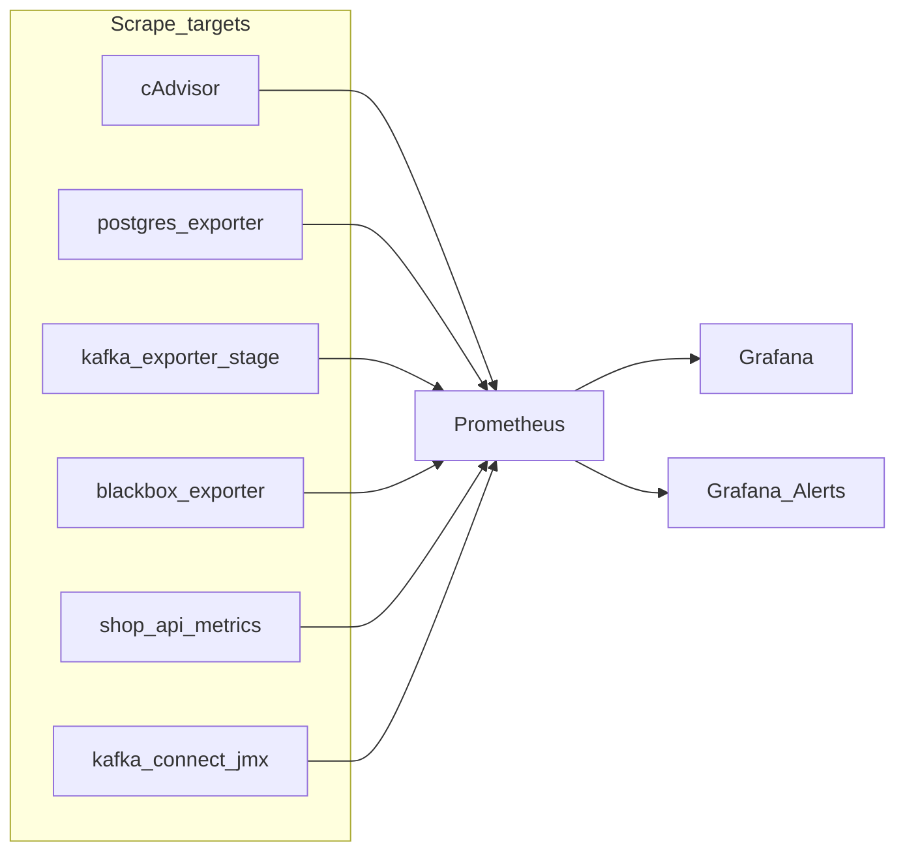

# Итоговый план: Prometheus + Grafana + документация (итерация 5)

## Контекст

Корневой [`compose.yaml`](/home/vonbraun/YA_KAFKA/07_Финальный_проект/ya_kafka_project_final/compose.yaml): PostgreSQL, два KRaft-кластера Kafka, Schema Registry, Mirror Maker, Kafka Connect, ksqlDB, Spark, Kafka UI, **shop-api-app** (Faust). В [`README.md`](/home/vonbraun/YA_KAFKA/07_Финальный_проект/ya_kafka_project_final/README.md) якорь [`dev_proc_iteration_5`](README.md) сейчас — заглушка «TODO».

Для Connect в compose уже намечен путь JMX → Prometheus (сейчас закомментирован):

```1055:1057:/home/vonbraun/YA_KAFKA/07_Финальный_проект/ya_kafka_project_final/compose.yaml
      # Export JMX metrics to :9876/metrics for Prometheus
      # KAFKA_JMX_PORT: '9875'
      # KAFKA_OPTS: "-javaagent:/opt/jmx_prometheus_javaagent-0.15.0.jar=9876:/opt/kafka-connect.yml"
```

---

## Цель и границы

- **Показать:** сбор метрик, дашборды, **один** учебный алерт (ksqlDB через blackbox), плюс **пример JVM-инструментирования** на Kafka Connect и **прикладные** метрики shop-api.
- **Не раздувать:** без JMX на всех 12 Kafka-нодах, без Alertmanager (достаточно Grafana Unified Alerting + contact point).



---

## 1. cAdvisor

CPU/RAM по контейнерам всего Compose. Prometheus и cAdvisor в **обеих** Docker-сетях stage и mart (как Postgres).

---

## 2. Kafka: kafka_exporter (stage)

Один экспортёр на **stage** (bootstrap `SB_*` / порт `*_PORT_92` из [.env.example](.env.example)). SASL_SSL + клиентские сертификаты как у остальных клиентов; отдельная учётка с нужными ACL.

**Второй экспортёр на mart** — по-прежнему опционально (не входит в обязательный минимум).

JMX **на брокерах** не включаем.

---

## 3. PostgreSQL

Один **postgres_exporter** + job в Prometheus.

---

## 4. blackbox_exporter

Минимум: **ksqlDB** `GET http://ksqldb-server:${SERVICE_KSQLDB_SERVER_PORT}/info`, **shop-api** (хост/порт из `.env`). Schema Registry с жёстким mTLS для blackbox можно не усложнять — зафиксировать в README как ограничение.

---

## 5. shop-api-app: `/metrics` (обязательно)

Добавить **`/metrics`** (`prometheus_client` + встраивание в существующий веб-слой Faust). Достаточно базовых process-метрик экспортёра и 1–2 прикладных счётчиков (например события/ошибки), без перераздувания. Отдельный scrape job в Prometheus по внутреннему имени/порту контейнера.

---

## 6. Kafka Connect: JMX javaagent → `/metrics` (обязательно)

- Раскомментировать и **довести до рабочего состояния** блок `KAFKA_OPTS` / порт (или эквивалент: проброс jar + `kafka-connect.yml` через volume/custom образ).
- Убедиться, что Prometheus достучится до `kafka-connect:9876/metrics` (или выбранного порта) из общей сети.
- В README кратко указать имя job и что смотреть на дашборде (например задачи коннекторов / JVM — по доступным метрикам конфига).

---

## 7. Grafana

- Импорт готовых панелей: cAdvisor, Kafka Exporter, Postgres; при желании — панель targets `up`.
- **Один alert** (§7.1), один **Contact point** (§7.2).

### 7.1. Алерт: недоступен ksqlDB

**Условие:** `probe_success == 0` для цели blackbox, соответствующей ksql `/info` (точные labels после настройки `prometheus.yml`). **`for`:** 1m–2m.

**Демо:** остановить контейнер ksqlDB → Firing → start → Resolved.

**Почему не «брокеров &lt; 3»:** [issue kafka_exporter #134](https://github.com/danielqsj/kafka_exporter/issues/134) — метрика числа брокеров не всегда отражает падение ноды.

### 7.2. Contact point

Вариант A: только UI Grafana + виджет Alert list. Вариант B: Webhook (webhook.site / локальный echo).

---

## 8. RAM (32 ГБ)

Короткий retention у Prometheus; scrape 15–30s. Мониторинг-хвост обычно ~1–1.5 ГБ; основная нагрузка — Kafka + Spark.

---

## 9. Опционально (вне обязательного объёма)

- Второй kafka_exporter (mart), node_exporter на хосте, дополнительные правила Grafana.

---

## 10. README: «Разработка: Итерация 5: Мониторинг: Prometheus, Grafana»

Заменить TODO в разделе с якорем `dev_proc_iteration_5` на связный текст **без лишней простыни**. Обязательные подпункты:

### 10.1. Структура мониторинга (кратко)

- Таблица или список: **сервис** → **роль** → **URL/порт для проверки** (внутренний DNS Docker где уместно).
- Где лежат конфиги: `prometheus.yml`, provisioning Grafana (если делается файлами), путь к `kafka-connect` JMX yaml.
- Как поднять только мониторинг или полный стек + мониторинг (профиль `monitoring` / команда `docker compose`, если так заведёте).
- URL по умолчанию: **Prometheus** (:9090), **Grafana** (:3000) — точные порты зафиксировать в README после добавления в compose / `.env.example`.

### 10.2. Тестирование и наглядная проверка работоспособности (важно)

Пошаговый чеклист, воспроизводимый на чистой машине после `docker compose up`:

1. **Prometheus → Status → Targets:** все нужные jobs в `UP` (в т.ч. `shop-api`, `kafka-connect`, `blackbox`, `kafka-exporter`, `postgres`, `cadvisor`).
2. **Запросы в Prometheus UI** (примеры PromQL в README): например `up`, `probe_success`, одна метрика из kafka_exporter, `pg_up`, строка из shop-api `/metrics` (имя метрики), счётчик из Connect JMX scrape.
3. **Grafana:** открыть импортированные дашборды, убедиться что данные тянутся (не «No data»).
4. **HTTP вручную:** `curl` к `http://shop-api:…/metrics` (или с хоста через опубликованный порт), `curl` к `http://kafka-connect:…/metrics` (если порт проброшен наружу для отладки — иначе `docker exec` в prometheus wget).
5. **Алерт:** убедиться что правило в состоянии Normal; выполнить `docker stop` на контейнере ksqlDB; дождаться **Firing**; `docker start`; убедиться в **Resolved** (и в webhook, если настроен).
6. **Краткая «негативная» проверка (опционально в тексте):** остановить postgres_exporter или blackbox — соответствующий target падает в Prometheus (показать, что мониторинг это видит).

Итерация 5 считается **закрытой по документации**, когда читатель может по README воспроизвести проверки без догадок.

---

## Порядок реализации (рекомендуемый)

1. Compose + Prometheus + scrape всех статических целей (cadvisor, postgres, blackbox, kafka_exporter).
2. shop-api `/metrics` + scrape.
3. Connect JMX + scrape.
4. Grafana + дашборды + алерт + contact point.
5. **README итерация 5** (§10) — в конце, когда порты и имена job финальны.

После согласования с командой допускается **compose profile `monitoring`**, чтобы основной файл не обязал всех поднимать Prometheus.
